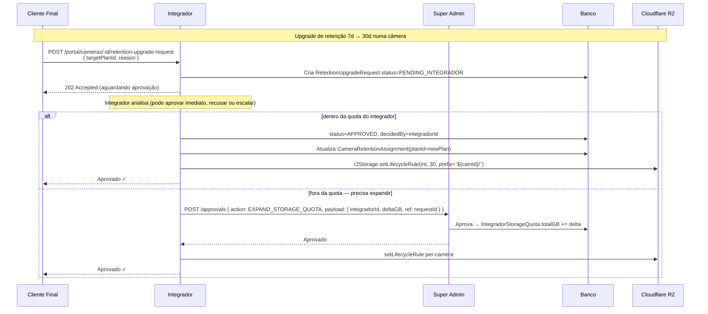
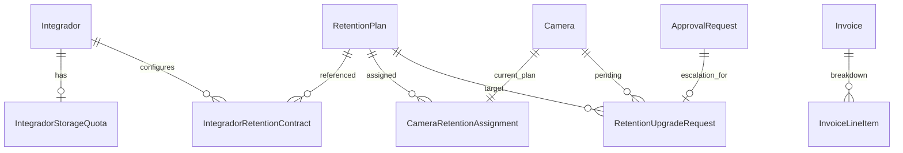

# 17 — Plano Fim-a-Fim de Administração de Armazenamento e Gravações

> **Data:** 2026-05-06 · **Status:** Proposta inicial
> **Autor:** Tarcísio (drafted by Claude)
> **Complementa:** `docs/16-PLAN-WHITELABEL-PRICING-MULTITENANT.md`
> Este doc cobre o **fluxo operacional** de gravação em nuvem (storage R2,
> retenção 3-180d, billing repassado). Pricing/CMS de planos da plataforma
> permanece em `docs/16`. Quando os dois colidirem, `docs/16` ganha em
> "preço público da plataforma" e este doc ganha em "armazenamento e
> retenção por câmera".

---

## Sumário Executivo

A plataforma já tem o miolo técnico de gravação multi-tenant pronto: ffmpeg
supervisor → segmentos HLS .ts → upload assíncrono pra R2 (bucket-por-integrador)
→ playback com presigned URL. Existe lifecycle por bucket (1 retenção
global por integrador, 1-365d) e auditoria de acesso (`StorageAccessLog`).
Falta a **camada comercial**: catálogo de planos de retenção (3-180d) com
preço de custo + preço de venda, atribuição por câmera, fluxo de aprovação
super-admin → integrador → cliente final, billing mensal automático
baseado em consumo real R2 com markup configurável, e dashboards de margem
para cada papel. R2 com egress zero e bucket-por-integrador é a vantagem
arquitetural — falta vesti-la de produto.

---

## 1. Diagnóstico do Estado Atual

### 1.1 Mapa do fluxo de gravação (live → segmento → R2 → playback)

```mermaid
flowchart LR
  CAM[Câmera RTSP/RTMP_PUSH] -->|RTSP| GO2RTC[go2rtc :8554]
  CAM -->|RTSP_PULL ou RTMP| FF[ffmpeg supervisor<br/>recording.service]
  GO2RTC --> FF
  FF -->|.ts 6s| LOCAL[(/recordings local<br/>{cam}/{date}/{ts})]
  LOCAL -->|uploadToCloud async| R2[(R2 bucket<br/>icv-{integradorId}/<br/>{cam}/{date}/{ts})]
  EDGE[Edge Box deploymentMode=EDGE_BOX] -->|POST /iacv-box/segments/upload| INGEST[recording-ingest.service]
  EDGE -.presigned PUT.-> R2
  INGEST --> LOCAL
  PLAY[Playback / Export] -->|presigned R2 URL<br/>fallback local| R2
  PLAY --> LOCAL
  RET[recording.service tickRetention 1h] -->|deleteMany por endedAt < cutoff| R2
  RET --> DB[(RecordingSegment)]
```

### 1.2 Componentes existentes — maturidade

| Componente | Arquivo | Papel | Maturidade |
|---|---|---|---|
| R2 multi-tenant (bucket-per-integrador) | `vsaas-backend/src/services/r2-storage.service.ts` | ensureBucket / upload / lifecycle / browse / getStats / deleteByPrefix | ✅ pronto |
| S3 fallback custom (Hetzner/AWS/MinIO) | `vsaas-backend/src/services/s3-storage.service.ts` | per-integrador own bucket | ✅ pronto (legacy compat) |
| Storage abstraction local + cloud | `vsaas-backend/src/services/recording-storage.service.ts` | uploadToCloud, getReadStream, removeMany, presignedUrl | ✅ pronto |
| Supervisor ffmpeg (CLOUD_DIRECT) | `vsaas-backend/src/services/recording.service.ts` | spawn, segment, retention tick por câmera | ✅ pronto |
| Ingest do edge box | `vsaas-backend/src/services/recording-ingest.service.ts` | dedup, persist, sobe R2 | ✅ pronto |
| Storage config UI por integrador | `vsaas-backend/src/routes/storage-config.ts` (`PUT /storage/config`) | retainDays, useR2, customS3, lifecycle rule | 🟡 parcial (1 rule global por bucket) |
| Visão global super admin | `GET /storage/global` | lista buckets, GB total, breakdown por cliente | ✅ pronto |
| Browse / preview / órfãos / logs | `routes/storage-config.ts` | `/browse`, `/preview`, `/orphans`, `/logs` | ✅ pronto |
| Lifecycle rules por prefix (câmera) | `r2Storage.setLifecycleRule(int, days, prefix)` | API existe, UI só seta default global | 🟡 sub-utilizada |
| Auditoria de acesso | `StorageAccessLog` + `logStorageAccess()` | INSERTs em DELETE_ORPHANS, VIEW_BUCKET | 🟡 parcial (várias rotas não logam) |
| Quota R2 por consumo (GB) | n/a | `ApiQuota` cobre só Vision/Streaming, não storage | ❌ ausente |
| Plano comercial de retenção (3-180d) por câmera | n/a | `Camera.recordRetainDays` é só técnico, sem amarração com preço | ❌ ausente |
| Workflow de upgrade de retenção (CF→Int→SA) | `routes/approvals.ts` | `ApprovalAction` tem 8 ações, **nenhuma para storage/retention** | ❌ ausente |
| Cálculo de custo R2 real → fatura | n/a | `Invoice` é mensal por integrador mas só com `gcsTotalGb` (Hetzner antigo) e `vertex/vision`. Não há linha de R2. | ❌ ausente |
| Markup configurável por integrador | n/a (`PlatformPlan.wholesalePriceMonthly` existe pra plataforma, não pra retenção) | precisa de tabela própria | ❌ ausente |
| Cobrança automática (Asaas) integrada com consumo R2 | `routes/admin-billing.ts` + `services/asaas.service.ts` | Asaas provisionado com `BILLING_ENABLED=false`. Não emite cobrança automática nem por consumo. | 🟡 provisionado, inativo |
| Visibilidade pro cliente final do que paga | `TenantCockpitPage StorageTab` mostra GB consumido | Não converte em R$, não mostra plano contratado, não tem botão "upgrade" | 🟡 parcial |
| Dashboard de margem do integrador | n/a | Custo R2 vs. preço cobrado não é exibido | ❌ ausente |
| `prisma.recording.count` em `routes/integradores.ts:1006` | dead-code | Tabela `Recording` não existe (só `RecordingSegment`) | ❌ bug latente |

### 1.3 Modelo de dados atual (relevante)

```
Integrador
 ├ storageEndpoint/Region/Bucket/AccessKey/SecretKey     — custom S3 opcional
 ├ storageRetainDays  Int  @default(30)                  — único valor global do integrador
 ├ storageBuckets[]   StorageBucket                      — modelo paralelo (totalBytes, objectCount)
 └ storageAccessLogs[]                                   — auditoria

ClienteFinal
 └ storageUsage[]    StorageUsage                        — breakdown por cliente

Camera
 ├ recordEnabled         Boolean
 ├ recordMode            RecordingMode  (DISABLED/MOTION/ALL/ACTIVE_OBJECTS)
 ├ recordRetainDays      Int @default(7)                 — retenção principal
 ├ recordAlertRetainDays Int @default(30)
 ├ recordDetectionRetainDays Int @default(14)
 ├ recordPreCaptureSec/PostCaptureSec
 └ recordingSegments[]   RecordingSegment

RecordingSegment
 ├ cameraId, startedAt, endedAt, durationSec, sizeBytes BigInt
 ├ storagePath         String  (relativo: {camId}/{date}/{ts}_{uuid}.ts)
 └ codec/width/height/fps/hasMotion/hasEvent/spriteUrl

StorageBucket  (modelo "official", parcialmente usado)
 ├ integradorId, type R2|S3|CUSTOM, name, endpoint, region, accessKeyEnc, secretKeyEnc
 ├ retainDays Int @default(30)
 ├ totalBytes BigInt @default(0), objectCount Int — atualizados por cron (não há cron hoje)
 ├ lastSyncAt DateTime?
 └ usageRecords[] StorageUsage

StorageUsage
 └ bucketId / clienteFinalId / cameraId / usedBytes / objectCount / recordedAt

StorageAccessLog
 └ actorType (SUPER_ADMIN|INTEGRADOR|USER), actorId, action enum, integradorId/clienteFinalId/cameraId,
   bucketName, objectKey, objectCount, bytesAffected, metadata, success, ipAddress, userAgent

ApprovalRequest (Lote 6)
 └ action enum (CREATE_INTEGRADOR | DELETE_* | RESET_PASSWORD | PROVISION_EDGE_NODE | CHANGE_BILLING | CONVERT_LEAD)
   — não tem ação para storage/retention upgrade.

ApiQuota
 └ Cobre Vision/Streaming. Não tem campo de storage GB.

PlatformPlan (CMS pricing master + override por tenant)
 └ wholesalePriceMonthly = piso pra override do integrador (já implementado).
   retentionDays: Int? (caps do plano), retention: String "7 dias" — texto livre, não parametrizado por câmera.

VMSStoragePrice
 └ resolution × days → priceIACV / priceMonuv  — matriz já existe na pricing pública,
   mas hoje é só conteúdo do site, não tem ligação com câmera/integrador/billing.

Invoice
 └ visionApiCalls, vertexStreamMinutes, gcsTotalGb (legado Hetzner), totalAmountBrl, gcpCostUsd, marginPercent
   — não tem linha "storage R2 GB consumidos × $/GB", não tem breakdown.

AsaasCustomer / AsaasSubscription
 └ Provisionados com BILLING_ENABLED=false. Subscription mensal por integrador,
   não por consumo R2. Webhook recebe eventos.
```

### 1.4 Gaps identificados (ordenados por criticidade)

**P0 — bloqueia produto comercial:**

1. **Plano de retenção por câmera não existe como entidade comercial.** Hoje é só `Camera.recordRetainDays` (Int). Não há catálogo (3, 7, 15, 30, 60, 90, 120, 180), não há preço de custo, não há preço de venda, não há histórico de mudança. Trocar de 7→30 não dispara cobrança.
2. **Custo R2 não é calculado nem repassado.** Não há tabela com $/GB (Cloudflare), $/1M Class A ops, $/1M Class B ops. `Invoice` tem `gcsTotalGb` mas é legado Hetzner. R2 stats existem (`r2Storage.getStats`) mas não viram fatura.
3. **Markup do integrador não é parametrizável.** `PlatformPlan.wholesalePriceMonthly` cobre planos da plataforma — mas não há "preço-de-custo de retenção" → "preço-de-venda do integrador → cliente final".
4. **Workflow de aprovação para upgrade de retenção não existe.** `ApprovalAction` enum não tem `UPGRADE_RETENTION` nem `EXPAND_STORAGE_QUOTA`. Cliente final pede upgrade pra integrador que pede pro super admin — fluxo precisa ser criado.

**P1 — degrada UX:**

5. **Lifecycle rule R2 está sub-utilizada.** `r2Storage.setLifecycleRule(int, days, prefix='')` aceita prefix por câmera, mas a UI/`PUT /storage/config` só seta retenção global do bucket. Se câmera A precisa 7d e câmera B precisa 90d, hoje vence o maior (a app só apaga via DB cron, R2 lifecycle do bucket é o menor uniforme). Resultado: ou paga storage a mais, ou apaga antes do que cliente contratou.
6. **Cliente final não vê o que paga.** `StorageTab` em `TenantCockpitPage` mostra GB e retainDays, mas não mostra R$/mês, plano contratado, nem botão "upgrade".
7. **Integrador não vê margem.** Não há dashboard "GB consumido × $custo R2 × R$ cobrado × margem".
8. **`StorageBucket` e `StorageUsage` estão semi-órfãos.** Modelos existem mas não há cron alimentando — `r2Storage.getStats()` é chamado on-demand a cada GET, custa Class B ops e é lento.

**P2 — saneamento:**

9. **Auditoria parcial.** `logStorageAccess()` é chamada em DELETE_ORPHANS e VIEW_BUCKET (orphans), mas não em browse/preview/lifecycle update/config update — falha pra GDPR/LGPD/contratos B2B2B.
10. **`prisma.recording.count` em `integradores.ts:1006`** referencia tabela inexistente — silenciado por `.catch(() => 0)`. Limpar.
11. **R2_BUCKET_PREFIX é hardcoded** (`icv` default). Custom domains/whitelabel completo precisam preservar a marca real ou parametrizar.

---

## 2. Modelo Comercial (Passthrough Cloudflare R2)

### 2.1 Preço público R2 (referência — validar antes de fechar contrato)

Fonte: <https://www.cloudflare.com/pt-br/developer-platform/products/r2/> (em USD).

| Item | Preço (USD) | Observação |
|---|---|---|
| Storage | **$0.015 / GB-mês** | sem mínimo |
| Class A operations (PUT/COPY/POST/LIST) | **$4.50 / 1M** | escrita |
| Class B operations (GET/HEAD) | **$0.36 / 1M** | leitura |
| Egress (saída) | **$0.00** | diferencial-chave R2 |
| Free tier | 10 GB-mês storage + 1M Class A + 10M Class B | aplicável à conta-mãe IACloud, não por integrador |

**Conversão BRL (validar mensalmente):** câmbio referencial USD→BRL = R$ 5,20 (atualizar). Buffer cambial **5%** sugerido. Logo:
- Storage: ~**R$ 0,082/GB-mês** (custo)
- Class A: ~**R$ 24,57 / 1M ops**
- Class B: ~**R$ 1,97 / 1M ops**

⚠️ Esses valores **devem ser revalidados** na primeira execução do plano (Fase 1) — Cloudflare ajusta lista periodicamente. Manter `RetentionPlan.costSourceCheckedAt`.

### 2.2 Custo unitário estimado por câmera/dia

Premissas (validar com medição real do `RecordingSegment.sizeBytes`):
- Segmento HLS .ts de 6s (`SEGMENT_SECONDS=6`)
- Apenas vídeo (`-an` no ffmpeg) — sem áudio
- 24h de gravação contínua = **14.400 segmentos/dia/câmera**
- Overhead container .ts ≈ 5% sobre payload H.264

| Cenário | Bitrate | GB/dia/câmera | PUTs/dia (Class A) | GETs típicos/dia (playback eventual) |
|---|---|---|---|---|
| **Low (SD 480p)** | 1 Mbps | 10,8 GB | 14.400 | 50 (3 visualizações) |
| **Med (HD 720p)** | 3 Mbps | 32,4 GB | 14.400 | 100 |
| **High (FHD 1080p)** | 6 Mbps | 64,8 GB | 14.400 | 200 |
| **4K** | 12 Mbps | 130 GB | 14.400 | — fora de escopo MVP |

**Custo R2 por câmera/mês (cenário Med, 30 dias storage médio = retenção do plano ÷ 2 ponderada):**

Para retenção R dias, storage médio diário ≈ R/2 × GB/dia (curva linear de retenção). Para R=30 e Med:
- Storage médio: 30/2 × 32,4 = **486 GB-mês**
- Custo storage: 486 × $0.015 = **$7,29**
- Class A: 14.400 × 30 = 432k ops/mês × $4.50/1M = **$1,94**
- Class B: ~3k/mês × $0.36/1M = **$0,001** (negligível)
- **Total: ~$9,24/câmera/mês = R$ 48,05** (cenário Med, R=30)

⚠️ "Storage médio = R/2 × GB/dia" só vale com gravação contínua + retenção estabilizada (≥R dias rodando). Em gravação por motion (cenário real), GB/dia cai 60-90%. **Validar com medição.**

### 2.3 Tabela de planos sugeridos (cenário Med, motion 50% duty cycle)

Premissas para o sugerido:
- GB/dia efetivo = 32,4 × 0,5 = **16,2 GB/dia** (motion 50%)
- Storage médio = R/2 × 16,2
- Custo R2/câmera/mês = (R/2 × 16,2 × $0.015) + ops
- Câmbio R$ 5,20, buffer 5% = ×5,46

| Retenção | GB médio/cam | Custo R2/cam (USD) | Custo R2/cam (R$) | **Preço IACloud→Integrador** (margem 50%) | **Preço Integrador→CF** (markup default 30%) |
|---|---|---|---|---|---|
| 3 dias | 24,3 | $0,38 | R$ 2,07 | R$ 4,15 | R$ 5,40 |
| 7 dias | 56,7 | $0,87 | R$ 4,76 | R$ 9,52 | R$ 12,38 |
| 15 dias | 121,5 | $1,84 | R$ 10,07 | R$ 20,14 | R$ 26,18 |
| 30 dias | 243 | $3,66 | R$ 20,03 | R$ 40,06 | R$ 52,08 |
| 60 dias | 486 | $7,30 | R$ 39,93 | R$ 79,87 | R$ 103,83 |
| 90 dias | 729 | $10,94 | R$ 59,84 | R$ 119,68 | R$ 155,58 |
| 120 dias | 972 | $14,58 | R$ 79,75 | R$ 159,50 | R$ 207,35 |
| 180 dias | 1.458 | $21,86 | R$ 119,57 | R$ 239,14 | R$ 310,88 |

**Comparação com `VMSStoragePrice` (Full HD) já no CMS:** Conferir; minha sugestão é **mais barata** que Monuv e leve sobre o custo. Margem IACloud 50% é confortável; margem integrador 30% deixa espaço pra ele baixar em volume.

> Validar: bitrate médio efetivo das câmeras dos integradores piloto. Medir com `prisma.recordingSegment.aggregate({ _avg: { sizeBytes }, _avg: durationSec })` em janela de 7 dias antes de fechar tabela.

### 2.4 Política de overflow

Quando câmera com plano de 30d acumula GB acima do esperado (motion trigger anormal, mudou de SD pra FHD sem replanejar):

**Recomendação: SOFT_WARN + bill overage.**
- 80% do esperado (`expectedGB = retainDays/2 × budgetGBPerDay`): warning email pro integrador
- 100%: warning email pro cliente final
- 120%: cobra overage proporcional na fatura do mês (R$/GB excedido = preço de venda ÷ GB esperado)
- 150%: bloqueia novos uploads (usa `ApiQuota.hardLimitEnabled` análogo) **somente após confirmação manual** do super admin (evita perder evidência forense)

Ferramentas existentes que ajudam: `QuotaBlockPolicy` enum (HARD_BLOCK | SOFT_WARN | AUTO_UPGRADE) já existe no schema — podemos reutilizar a semântica.

---

## 3. Fluxo Operacional por Papel

### 3.1 Super Admin (IACloud)

| # | Ação | Como | Status atual |
|---|---|---|---|
| a | Aprovisiona buckets R2 na conta-mãe | `r2Storage.ensureBucket(integradorId)` é chamado on-demand no primeiro upload ou via `PUT /storage/config { useR2: true }` | ✅ pronto |
| b | Cria catálogo de planos de retenção (3-180d) | 🆕 `RetentionPlan` model + UI `/admin/retention-plans` | ❌ falta |
| c | Aprova/recusa upgrade de quota vindo do integrador | 🆕 `ApprovalAction.EXPAND_STORAGE_QUOTA` + UI `/admin/approvals` (já tem) | 🟡 falta enum |
| d | Visualiza margem real (R2 cost × bill) | 🆕 dashboard `/admin/storage/margin` consumindo R2 stats + `Invoice.lineItems` | ❌ falta |
| e | Gera fatura mensal pro integrador (storage line) | 🆕 cron `billing-cycle.cron.ts` 1º do mês roda `computeStorageInvoice(integradorId)` | ❌ falta |
| f | Suspende integrador inadimplente preservando dados N dias | 🆕 status `Integrador.suspendedAt` + `dataPurgeScheduledAt` + cron purge | ❌ falta |

**Telas necessárias:**
- `/admin/retention-plans` — CRUD do catálogo
- `/admin/storage/global` (já existe `GET /storage/global` — extender com colunas margem $/MRR/cobrado)
- `/admin/approvals` (já existe — adiciona filtro por action `EXPAND_STORAGE_QUOTA` / `UPGRADE_RETENTION`)
- `/admin/billing/integrador/:id/storage-cycle` — preview da próxima fatura
- `/admin/integradores/:id/suspend` — soft-suspend com `gracePeriodDays`

**Permissões:** já há `requireRole('SUPER_ADMIN', 'ADMIN_GLOBAL')` em todas as rotas relevantes. Manter.

**SLA de aprovação:** sugerido 24h business (sem auto-aprovação). Configurável via env `APPROVAL_SLA_HOURS`.

### 3.2 Integrador

| # | Ação | Como | Status |
|---|---|---|---|
| a | Vê catálogo de retenções da plataforma com preço de custo | 🆕 `GET /me/integrador/retention-plans` (lista master) | ❌ |
| b | Define markup padrão (% sobre cost) | 🆕 `Integrador.retentionMarkupPct Float @default(30)` (ou tabela `IntegradorRetentionContract` com markup por plano) | ❌ |
| c | Atribui plano de retenção a câmera/cliente | 🆕 `PUT /me/cameras/:id/retention-plan { planId }` cria `CameraRetentionAssignment` | ❌ (hoje só `Camera.recordRetainDays` solto) |
| d | Solicita upgrade de capacidade | 🆕 `POST /me/integrador/storage-quota-upgrade` cria `ApprovalRequest action=EXPAND_STORAGE_QUOTA` | ❌ |
| e | Aprova upgrade pedido pelo cliente final | 🆕 `POST /me/approvals/:id/approve` (escopo do integrador, distinto do approvals do super admin) | ❌ |
| f | Dashboard margem mensal | 🆕 `/me/integrador/billing/storage` mostra: GB consumidos × custo unitário × R$ cobrado dos clientes finais × margem | ❌ |
| g | Auto-billing pro cliente final | 🆕 cron faz "subfatura" por cliente final usando `IntegradorRetentionContract.markupPct` | ❌ (depende do gateway) |

**Telas necessárias:**
- `/me/whitelabel` (já existe, hub) → nova sub-tab **"Storage & Retenção"**
  - Lista planos master (read-only) + markup configurável + preço final
  - Botão "Solicitar mais quota"
- `/me/clientes-finais/:id/cameras` → coluna nova **"Plano de Retenção"** com botão atribuir
- `/me/integrador/billing` (refatorar `routes/admin-billing.ts` analog pra escopo integrador) → aba "Storage" mostrando GB×R$×margem

### 3.3 Cliente Final

| # | Ação | Como | Status |
|---|---|---|---|
| a | Vê consumo (GB) e custo (R$/mês) por câmera | `TenantCockpitPage StorageTab` (já mostra GB) — falta R$ | 🟡 falta R$ |
| b | Solicita upgrade de retenção (vai pra fila integrador) | 🆕 `POST /portal/cameras/:id/retention-upgrade-request` cria `RetentionUpgradeRequest` | ❌ |
| c | Visualiza/baixa gravações | `routes/playback.ts` + `routes/recordings-segments.ts` — já existe | ✅ |
| d | Notificado X dias antes do vencimento | 🆕 cron `notify-billing.service.ts` envia email D-3 e D-7 | ❌ |
| e | Cliente direto-em-nuvem (sem integrador) | `Integrador` "IACloud Direct" virtual + permissões | ❌ (TBD) |

**Telas necessárias:**
- `TenantCockpitPage StorageTab` (já existe) → adicionar painel **"O que você está pagando"**:
  - Plano por câmera (3/7/30/...)
  - GB consumidos vs. plano
  - R$/mês previsto
  - Botão "Solicitar upgrade" → abre `RetentionUpgradeRequest`
- `/portal/billing` no portal do cliente final (se white-label PRO+ já liberado)

### 3.4 Diagrama de fluxo de aprovação



---

## 4. Modelo de Dados Proposto

### 4.1 Novos modelos / extensões Prisma

```prisma
// Catálogo de planos de retenção (gerenciado pelo super admin)
model RetentionPlan {
  id              String   @id @default(uuid())
  /// "3d" "7d" "30d" "180d" — slug estável
  slug            String   @unique
  retainDays      Int      // 3, 7, 15, 30, 60, 90, 120, 180
  /// Custo de referência calculado (BRL) — atualizado por job mensal
  /// quando preço Cloudflare/câmbio mudam.
  costRefBRL      Decimal  @db.Decimal(10, 2)
  /// Preço de venda IACloud → Integrador (margem do fabricante embutida).
  /// É o "wholesalePriceMonthly" do plano de retenção.
  priceB2BBRL     Decimal  @db.Decimal(10, 2)
  /// Preço público sugerido (para UI do CMS) — integrador pode override.
  priceSuggestedRetailBRL Decimal? @db.Decimal(10, 2)

  /// Premissa de cálculo: bitrate Mbps assumido (1, 3, 6, 12)
  bitrateMbps     Float    @default(3)
  /// Premissa de cálculo: % motion duty cycle (0..1)
  motionDutyCycle Float    @default(0.5)

  active          Boolean  @default(true)
  costSourceCheckedAt DateTime?
  createdAt       DateTime @default(now())
  updatedAt       DateTime @updatedAt

  assignments     CameraRetentionAssignment[]
  upgradeRequests RetentionUpgradeRequest[]

  @@index([active, retainDays])
}

// Contrato comercial entre IACloud e Integrador (markup default).
// Permite override per-plan (ex: integrador A paga preço diferenciado).
model IntegradorRetentionContract {
  id              String   @id @default(uuid())
  integradorId    String
  /// null = override default (markup % sobre TODOS os planos)
  retentionPlanId String?
  /// % sobre priceB2BBRL aplicado ao cliente final (default integrador)
  defaultMarkupPct Float   @default(30)
  /// Override do priceB2BBRL (negociação: super admin libera desconto)
  customCostBRL   Decimal? @db.Decimal(10, 2)

  active          Boolean  @default(true)
  createdAt       DateTime @default(now())
  updatedAt       DateTime @updatedAt

  integrador      Integrador     @relation(fields: [integradorId], references: [id], onDelete: Cascade)
  retentionPlan   RetentionPlan? @relation(fields: [retentionPlanId], references: [id])

  @@unique([integradorId, retentionPlanId])
  @@index([integradorId])
}

// Atribuição de plano a câmera (substitui/complementa Camera.recordRetainDays)
model CameraRetentionAssignment {
  id              String   @id @default(uuid())
  cameraId        String   @unique
  retentionPlanId String
  status          CameraRetentionStatus @default(ACTIVE)
  /// Markup efetivo aplicado a esta câmera (override do default do integrador)
  effectiveMarkupPct Float?
  /// Preço congelado quando o plano foi atribuído (proteção contra mudança
  /// retroativa). Recalculado em renew/cycle close.
  lockedPriceBRL  Decimal  @db.Decimal(10, 2)
  /// Quem atribuiu (audit)
  assignedByUserId String
  assignedAt      DateTime @default(now())
  /// Próximo cycle de billing (1º do mês seguinte)
  nextBillingAt   DateTime
  /// Preenchido quando upgrade aprovado mas ainda aguardando aplicação no R2
  pendingUpgradeRequestId String?

  camera          Camera         @relation(fields: [cameraId], references: [id], onDelete: Cascade)
  retentionPlan   RetentionPlan  @relation(fields: [retentionPlanId], references: [id])

  @@index([retentionPlanId])
  @@index([nextBillingAt])
  @@index([status])
}

enum CameraRetentionStatus {
  ACTIVE
  PENDING_UPGRADE
  PENDING_DOWNGRADE
  CANCELLED
}

// Pedido de upgrade fluindo CF → INT → SA
model RetentionUpgradeRequest {
  id              String   @id @default(uuid())
  cameraId        String
  /// Plano atual (snapshot)
  currentPlanId   String?
  /// Plano alvo
  targetPlanId    String
  /// Quem pediu (User do CF, integrador admin)
  requestedByUserId String
  reason          String?  @db.Text

  status          RetentionUpgradeStatus @default(PENDING_INTEGRADOR)
  /// Decisão do integrador
  integradorDecisionAt   DateTime?
  integradorDecisionUserId String?
  integradorDecisionNotes String? @db.Text
  /// Decisão do super admin (se escalado)
  superAdminApprovalRequestId String?  // FK para ApprovalRequest

  /// Aplicado em
  appliedAt       DateTime?
  expiresAt       DateTime  // 7 dias

  createdAt       DateTime @default(now())
  updatedAt       DateTime @updatedAt

  camera          Camera         @relation(fields: [cameraId], references: [id])
  targetPlan      RetentionPlan  @relation(fields: [targetPlanId], references: [id])

  @@index([status, expiresAt])
  @@index([cameraId])
}

enum RetentionUpgradeStatus {
  PENDING_INTEGRADOR     // aguardando integrador
  ESCALATED_SUPERADMIN   // integrador escalou
  APPROVED               // aprovado (próximo passo: aplicar)
  REJECTED               // rejeitado
  APPLIED                // aplicado no R2 + DB
  EXPIRED                // 7d sem decisão
}

// Cota total de storage que o integrador comprou do super admin.
// Quando câmera + plano > IntegradorStorageQuota.totalGB, integrador
// precisa solicitar EXPAND_STORAGE_QUOTA via ApprovalRequest.
model IntegradorStorageQuota {
  id              String   @id @default(uuid())
  integradorId    String   @unique
  /// Quota máxima vendida (GB-mês). null = sem limite (legacy / enterprise)
  totalQuotaGB    Float?
  /// Preço por GB excedente
  overagePricePerGB Decimal? @db.Decimal(10, 4)
  blockPolicy     QuotaBlockPolicy @default(SOFT_WARN)
  warningThreshold Int      @default(80)

  /// Computado por cron mensal
  currentUsageGB   Float    @default(0)
  currentBillingPeriod DateTime  // YYYY-MM-01

  integrador      Integrador @relation(fields: [integradorId], references: [id], onDelete: Cascade)
}

// Linha-item de fatura por câmera (para storage).
// Referenciado por Invoice.lineItems[] (relação 1:N).
model InvoiceLineItem {
  id              String   @id @default(uuid())
  invoiceId       String
  type            InvoiceLineType  // STORAGE | OVERAGE | AI_ADDON | ...
  cameraId        String?
  retentionPlanId String?
  /// Texto pra fatura: "Câmera Loja Sul — Retenção 30d"
  description     String
  quantity        Float    @default(1)  // GB ou cameras
  unitPriceBRL    Decimal  @db.Decimal(10, 4)
  totalBRL        Decimal  @db.Decimal(10, 2)
  /// Custo R2 real (Cloudflare cost) pra esta linha — pra cálculo de margem
  costR2BRL       Decimal? @db.Decimal(10, 4)

  invoice         Invoice @relation(fields: [invoiceId], references: [id], onDelete: Cascade)

  @@index([invoiceId])
  @@index([cameraId])
}

enum InvoiceLineType {
  STORAGE
  STORAGE_OVERAGE
  RETENTION_UPGRADE_PRORATA
  AI_ADDON
  PLAN_BASE
  CUSTOM
}
```

### 4.2 Extensões em modelos existentes

```prisma
// Integrador
model Integrador {
  // ...existente...
  /// Markup default sobre RetentionPlan.priceB2BBRL aplicado a CFs deste integrador.
  /// Sobreescrito por IntegradorRetentionContract.defaultMarkupPct (per-plan).
  retentionMarkupPct Float @default(30)
  /// Suspenso por inadimplência ou ação manual do super admin.
  suspendedAt        DateTime?
  /// Quando os dados serão purgados (suspensão > N dias = delete).
  dataPurgeScheduledAt DateTime?

  storageQuota      IntegradorStorageQuota?
  retentionContracts IntegradorRetentionContract[]
}

// ApprovalAction — adiciona novas ações
enum ApprovalAction {
  // ...existente...
  EXPAND_STORAGE_QUOTA      // integrador pede +X GB pro super admin
  UPGRADE_RETENTION_PLAN    // CF → integrador pede plano maior (escalado se preciso)
  SUSPEND_INTEGRADOR        // super admin suspende por inadimplência
}

// Camera — recordRetainDays vira derivado de CameraRetentionAssignment
//   (mantém coluna pra compat por 1 ciclo de migration; depois remove)
```

### 4.3 Diagrama ER (apenas novos)



---

## 5. Lifecycle R2 e Mecânica Técnica

### 5.1 Configurar lifecycle por câmera

`r2Storage.setLifecycleRule(integradorId, retainDays, prefix)` já aceita prefix. Ação a tomar quando câmera muda de plano:

```ts
// services/retention-orchestrator.service.ts (NOVO)
async function applyRetentionPlan(cameraId: string, plan: RetentionPlan) {
  const integradorId = /* resolve via site.clienteFinal.integradorId */;
  // R2 lifecycle por câmera (prefix-based)
  await r2Storage.setLifecycleRule(integradorId, plan.retainDays, `${cameraId}/`);
  // DB: atualiza ou cria CameraRetentionAssignment
  await prisma.cameraRetentionAssignment.upsert({
    where: { cameraId },
    update: { retentionPlanId: plan.id, status: 'ACTIVE', lockedPriceBRL: ... },
    create: { ... }
  });
  // Mantém Camera.recordRetainDays sync por 1 ciclo (compat)
  await prisma.camera.update({ where: { id: cameraId }, data: { recordRetainDays: plan.retainDays } });
}
```

⚠️ **R2 lifecycle: validar limite real de regras por bucket.** Cloudflare documenta "até 1000 regras por bucket" — em 1 integrador com 200 câmeras de planos heterogêneos, cabe. Acima disso, agrupar por `(planId, integradorId)` em pseudo-prefixes é alternativa.

### 5.2 Medir consumo real

**Hoje:** `r2Storage.getStats(integradorId, prefix)` faz `ListObjectsV2` recursivo — custa Class B ops, lento em buckets grandes.

**Recomendação:**
1. Manter `getStats()` para queries on-demand (admin dashboard).
2. Novo cron `storage-usage.cron.ts` (rodar 1×/dia, 03:00 UTC) atualiza `StorageBucket.totalBytes` + `StorageUsage.usedBytes` por câmera.
3. Frontend lê do DB (rápido) — `getStats()` só pra refresh manual.
4. Alternativa futura: **Cloudflare R2 GraphQL Analytics API** (requer plano workers + plan ≥ Pro) — validar disponibilidade na conta-mãe.

### 5.3 Reconciliação custo Cloudflare-real vs. nosso billing

Cloudflare emite fatura mensal pra conta-mãe IACloud. Nosso `Invoice.totalAmountBrl` precisa bater com a fatura externa **dentro de uma tolerância** (≤ 5% — overhead de ops imprevistas).

Implementar `services/r2-cost-reconciler.service.ts`:
- Input manual (CSV da Cloudflare) ou via Billing API (validar disponibilidade)
- Compara: `SUM(InvoiceLineItem.costR2BRL) WHERE periodStart=mes` vs. fatura externa
- Loga discrepâncias em `ReconciliationLog` (novo modelo, simples)

### 5.4 Quando rodar cron de cobrança

```
00 02 1 * * — billing-cycle.cron.ts (1º do mês 02:00 UTC)
  ├ closeBillingPeriod(month-1)
  ├ for each integrador:
  │   ├ computeStorageUsage(month-1)  — usa StorageUsage e RecordingSegment.sizeBytes
  │   ├ generateInvoiceLineItems  → 1 line por câmera
  │   ├ createAsaasCharge (se BILLING_ENABLED=true)
  │   └ notifyEmail (D+0 fatura emitida)
  └ writeReconciliationCheckpoint
```

Latência aceitável: até 12h depois do fechamento. Não roda no path crítico (cliente não sente).

---

## 6. Plano de Implementação

### Fase 1 — Fundação (1-2 semanas)

**Escopo:** catálogo de planos + atribuição por câmera + lifecycle aplicado + medidor de consumo.

**Backend (criar):**
- `vsaas-backend/prisma/migrations/<ts>_retention_plans/migration.sql` — `RetentionPlan`, `CameraRetentionAssignment`, `IntegradorRetentionContract`, `IntegradorStorageQuota`, extensão `Integrador`
- `vsaas-backend/src/services/retention-orchestrator.service.ts` — `applyRetentionPlan()`, `previewCost()`
- `vsaas-backend/src/services/storage-usage.cron.ts` — atualiza `StorageBucket.totalBytes` 1×/dia
- `vsaas-backend/src/routes/admin-retention-plans.ts` — CRUD super admin
- `vsaas-backend/src/routes/me-retention.ts` — GET catálogo, GET/PUT atribuição por câmera
- Estender `vsaas-backend/src/routes/cameras.ts` — `PUT /cameras/:id/retention-plan`

**Backend (modificar):**
- `vsaas-backend/src/services/recording.service.ts` `tickRetention()` — passa a respeitar `CameraRetentionAssignment.retentionPlan.retainDays` ao invés de `Camera.recordRetainDays`
- `vsaas-backend/src/services/r2-storage.service.ts` — adicionar `applyPerCameraLifecycle()` helper

**Frontend:**
- `vsaas-frontend/src/pages/admin/RetentionPlansPage.tsx` (novo)
- `vsaas-frontend/src/pages/SettingsPage.tsx` `StorageSection` — adicionar painel "Catálogo de Retenção" (read-only pra integrador)
- `vsaas-frontend/src/pages/cameras/...` — coluna/drawer "Plano de Retenção"

**Schema:** migration acima.

**Testes obrigatórios:**
- Unit: `retention-orchestrator.service.spec.ts` — validar lifecycle aplicado e DB sync
- E2E: criar câmera → atribuir plano 30d → checar lifecycle rule no R2 (mock SDK) → mudar para 7d → checar regra atualizada
- Migration backfill: cada `Camera.recordRetainDays` existente vira `CameraRetentionAssignment` com plano correspondente (ou plano "legacy" sem cobrança)

**Riscos:**
- Limite 1000 regras/bucket — mitigar com `applyPerCameraLifecycle` que reaproveita regras de mesmo retainDays como "default rule" sem prefix por padrão
- Backfill em prod com >100k segmentos — testar em staging primeiro

### Fase 2 — Aprovações e Margem (1-2 semanas)

**Backend:**
- `prisma/migrations/<ts>_retention_upgrade_requests` — `RetentionUpgradeRequest`, extensão `ApprovalAction`
- `vsaas-backend/src/routes/me-retention-upgrades.ts` — POST upgrade-request, list, approve, reject
- `vsaas-backend/src/routes/portal-retention.ts` — endpoint do cliente final
- Estender `vsaas-backend/src/routes/approvals.ts` — handler `EXPAND_STORAGE_QUOTA` em approve()
- `vsaas-backend/src/services/margin-calculator.service.ts` — agrega R2 cost vs. priceB2B vs. cobrado CF

**Frontend:**
- `vsaas-frontend/src/pages/IntegradorBillingPage.tsx` (nova) → aba Storage com dashboard margem
- `vsaas-frontend/src/pages/TenantCockpitPage.tsx` `StorageTab` → adicionar painel "O que você paga" + botão "Solicitar upgrade"
- `vsaas-frontend/src/pages/AdminApprovalsPage.tsx` (existe) → filtro action=EXPAND_STORAGE_QUOTA

**Riscos:**
- UX da aprovação 2-níveis (CF → INT → SA) — desenhar mockups antes
- Latência percebida pelo CF — adicionar status visível ("aguardando integrador 2h")

### Fase 3 — Billing automático (2-3 semanas)

**Backend:**
- `prisma/migrations/<ts>_invoice_line_items` — `InvoiceLineItem`, `InvoiceLineType`
- `vsaas-backend/src/cron/billing-cycle.cron.ts` — schedule mensal
- `vsaas-backend/src/services/invoice-builder.service.ts` — gera InvoiceLineItem por câmera
- `vsaas-backend/src/services/asaas.service.ts` — habilitar `createCharge()` para storage cycle
- `vsaas-backend/src/services/r2-cost-reconciler.service.ts` — input CSV / API
- `vsaas-backend/src/routes/admin-billing-recon.ts` — UI super admin pra conferir

**Frontend:**
- `AdminBillingPage.tsx` — aba Reconciliação
- Email templates: `templates/invoice-storage.mjml`

**Schema:** migration above.

**Decisão pendente:** Asaas `BILLING_ENABLED=true` exige rotação de credenciais (constam em git history — ver CLAUDE.md alerta P0).

**Riscos:**
- Conformidade fiscal (NFe) — Asaas suporta, mas validar emissão automática
- Cambio variável (USD→BRL) impactando margem — congelar câmbio do mês quando fatura é gerada

### Fase 4 — Cliente direto-em-nuvem (sem integrador)

**Modelo:** criar um "Integrador IACloud Direct" virtual (uuid fixo) onde clientes diretos são CFs daquele integrador. Reutiliza todo o pipeline mas pula o passo do markup do integrador (markup = 0% ou markup direto IACloud).

**Backend:**
- Seed `integrador-iacloud-direct` em `prisma/seed.ts`
- Rota `/admin/clientes-finais/direct/create` — super admin cria CF direto

**Frontend:**
- `/admin/clientes-finais` (existe) — flag "Direto" + filtro

---

## 7. Decisões Pendentes (abrir com o Tarcísio)

1. **Câmbio USD→BRL: fixo mensal ou flutuante?** Sugestão: fixo no fechamento da fatura (1º do mês 02h), com buffer 5% — protege contra spikes.
2. **Margem padrão IACloud → Integrador:** sugestão **50%** (preço B2B = custo R2 × 2). Confirma?
3. **Markup default Integrador → Cliente Final:** sugestão **30%**. Configurável por integrador?
4. **Política de overflow (overage):** SOFT_WARN + bill (recomendado) ou HARD_BLOCK? E qual % gatilho?
5. **SLA aprovação upgrade de retenção:** 24h business? 4h? Auto-aprova se `delta_GB < threshold`?
6. **Quem cobra do cliente final?** IACloud com split via Asaas, OU integrador com boleta própria (e IACloud cobra só do integrador)? (Impacta gateway, NFe, e responsabilidade fiscal — diferença grande.)
7. **Suspensão inadimplente:** período de graça antes de purge? Sugestão **30 dias suspended → 60 dias purge**.
8. **R2 GraphQL Analytics API** está disponível no plano contratado? Senão, fica medição via ListObjectsV2 mesmo.
9. **VMSStoragePrice atual** (já no CMS, resolution × days) é o catálogo público. Esse plano sugere `RetentionPlan` separado por câmera. **Como reconciliar?** Sugestão: `RetentionPlan` é o operacional (interno + custo); `VMSStoragePrice` é o vitrine público. Sincronizar via service.
10. **Recriar `recordRetainDays` na `Camera`** (compat 1 ciclo) ou drop direto? Sugestão: manter 1 sprint, depois drop.
11. **Bitrate medido vs. estimado:** rodar job de medição em ambiente piloto antes de fechar tabela de preços?
12. **R2_BUCKET_PREFIX** parametrizar por whitelabel (integrador PRO+) ou manter `icv-`?

---

## 8. Métricas e KPIs

| KPI | Como medir | Alvo Sprint pós-Fase 3 |
|---|---|---|
| Custo R2 mensal vs. faturamento storage | Reconciler / `Invoice.totalAmountBrl` agregado | Margem real ≥ 35% |
| Margem por integrador | `margin-calculator.service.ts` | Mediana ≥ 25% |
| Tempo médio aprovação upgrade | `RetentionUpgradeRequest.integradorDecisionAt - createdAt` | < 8h business |
| % câmeras com plano (vs. sem plano legacy) | `count(CameraRetentionAssignment) / count(Camera WHERE recordEnabled)` | ≥ 95% após Fase 1 backfill |
| Churn por motivo "preço alto" | survey + tag em CF cancelados | < 10% |
| Storage GB total cresce vs. faturamento | `StorageBucket.totalBytes` evolução | Faturamento cresce pelo menos junto |
| % overage real / total faturado | `InvoiceLineType=STORAGE_OVERAGE / Invoice.total` | < 5% (sinal de plano sub-dimensionado) |

---

## 9. Referências Cruzadas

- `docs/16-PLAN-WHITELABEL-PRICING-MULTITENANT.md` — pricing CMS multi-tenant (planos da plataforma). Este doc **complementa** com camada operacional de gravação (`RetentionPlan` é orthogonal a `PlatformPlan`). Conflito a resolver: `VMSStoragePrice` (no escopo do 16) é vitrine pública; `RetentionPlan` (este doc) é catálogo interno. Decisão #9 acima.
- `docs/12-PLAN-FORTALECIMENTO-CLOUD-BOX.md` — gravação edge box (modo EDGE_BOX). Este doc cobre principalmente CLOUD_DIRECT mas o billing é o mesmo (ambos sobem segmentos pra R2 via `recording-storage.service`).
- `docs/08-PLAN-MERCADO-NACIONAL-B2B2B.md` — segmentação Onda 1-3 define o perfil dos integradores piloto que vão validar a tabela de preços.
- `CLAUDE.md` ⚠️ — credenciais R2 estão no git history (commits `b122d871`, `6aaa945b`). **Antes de habilitar billing automático e expor R2 a faturamento real, rotacionar.**
- `vsaas-backend/src/services/r2-storage.service.ts` — base técnica que este plano comercializa.
- `vsaas-backend/prisma/schema.prisma` linhas 327-413 (Integrador), 802-1060 (Camera), 1764-1795 (RecordingSegment), 3229-3336 (StorageBucket/Usage/AccessLog), 3345-3406 (PlatformPlan), 3442-3455 (VMSStoragePrice).

---

**Fim do plano 17.**
