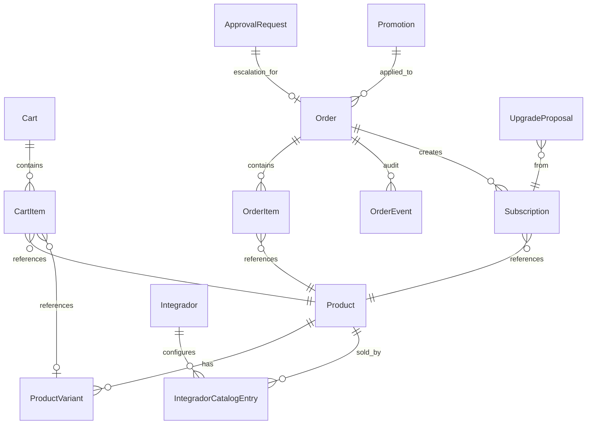
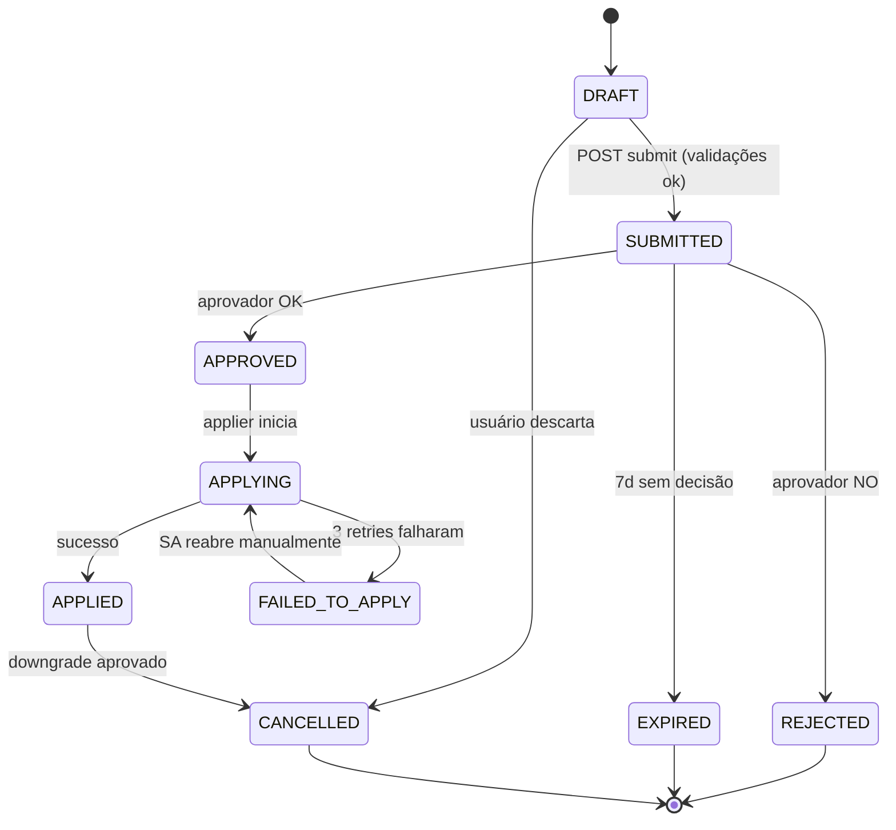

# 18 — Marketplace 3-Níveis Premium

> **Data:** 2026-05-06 · **Status:** Proposta inicial
> **Autor:** Tarcísio (drafted by Claude — staff engineer + senior product designer)
> **Complementa:** `docs/17-PLAN-STORAGE-ADMIN-FIM-A-FIM.md` (storage), `docs/16-PLAN-WHITELABEL-PRICING-MULTITENANT.md` (CMS pricing).
> Marketplace 3-níveis premium superior ao Monuv: vitrine self-service Integrador→Fabricante e Cliente Final→Integrador, painel comercial unificado.

---

## Sumário Executivo

A IACloud já tem o miolo (R2 multi-tenant, módulos AnalyticsModel, PlatformPlan multi-tenant com floor wholesale, ApprovalRequest genérico, AsaasCustomer provisionado). O que falta é o **front comercial unificado**: um Marketplace 3-níveis onde Integrador compra do Fabricante, configura mix de revenda, e Cliente Final faz upgrade/downgrade self-service no escopo do seu integrador. Tudo orquestrado por uma `Order` com state machine clara, aprovação cascateada (CF→INT→SA quando estoura quota), aplicação automática (lifecycle R2, ativação de módulo, troca de PlatformPlan, aplicação de bundle), prorata, billing repassado e dashboard de margem por papel. Storage segue `docs/17`. Este doc cobre IA, plano da plataforma, addons, kits verticais, bundles e UX premium superior ao Monuv. MVP em 4 fases (~6-7 semanas), foundation → integrador buy → reseller mix + CF self-service → painel comercial SA + polish.

---

## 1. Visão de Produto

### 1.1 Posicionamento

**Por que marketplace e não catálogo estático:**
- self-service real reduz fricção comercial (Onda 2-3 do `docs/08`); integrador não precisa abrir ticket pra ativar LPR
- captura intenção de compra (carrinho abandonado, view→cart funnel) e gera dados de demanda pro roadmap
- upsell automático: recomendação ML simples baseada em embedding de SKU (pgvector já no stack)
- 1 catálogo master, N vitrines (1 por integrador) com markup configurável → escala white-label sem código

**Diferencial vs. Monuv (extraído dos 2 snapshots em INCREMENTOS):**
- Monuv mostra produtos como cards estáticos com 1 chip "1 Licença / por câmera" e preço fixo, sem comparação, sem trial, sem ROI calculator, sem dependência declarada (LPR exige FHD+? não diz), sem bundle pricing, sem visibilidade de uso pós-compra
- Storage Monuv: matriz dias × resolução **bruta** — usuário precisa ler 40 cards e fazer cálculo mental
- IA Monuv: nomes opacos ("Anomal.IA", "Detecção de Suspeito"), sem preview, sem demo
- IACloud joga superior: cards com estado ("owned"/"trial"/"upgrade-available"), drawer de detalhe com ROI calc, preview interativo (clip de demo na própria card), bundle builder, recomendações cruzadas, transparência de uso real-time pós-compra

### 1.2 Personas (deriva de `docs/08`)

| Persona | Jobs to be done | Frustração atual em concorrentes |
|---|---|---|
| **Super Admin IACloud (comercial)** | Empacotar produtos, mover preço sem deploy, ver GMV/MRR/cohort, aprovar pedidos volumosos rapidamente, lançar promo em horas | Sales-ops manual, planilha de markup, sem GMV unificado |
| **Integrador Onda 1 (instalador 5-30 cams)** | Comprar plano básico + 30d storage + LPR sem chamar consultor, revender com markup decente, ver fatura clara | Aguarda dias por proposta, planilha pra calcular margem, dúvida de "quanto cobrar" |
| **Integrador Onda 2 (revendedor regional 100-500 cams)** | Configurar markup diferenciado por SKU, vender mix curado pra cada CF, escalar contratos, faturar próprio | Sistema do concorrente esconde custo, cobrança não bate com fatura, sem mix curado |
| **Integrador Onda 3 (SI grande 500+ cams)** | Negociação 1-1 (descontos override), suporte enterprise, integração API com ERP próprio | Concorrente trata todos iguais, ou exige contrato anual em papel |
| **Cliente Final varejo (3-15 lojas)** | Self-service real upgrade ("preciso 30→60d agora"), ver ROI antes de pagar, evidência forense imediata | Liga pro integrador → 2-3 dias pra subir retenção; surpresa na fatura |
| **Cliente Final condomínio (1 site, 8-30 cams)** | Pagar mensal sem contrato, simplicidade absoluta, mobile-first | Tem que abrir ticket pra qualquer mudança; portal mobile capenga |
| **Cliente Final indústria/compliance** | LPR + EPI + audit trail, prova de retenção pra norma, integração com SI próprio | Audit log fragmentado, sem upgrade self-service por planta |

### 1.3 Catálogo de Produtos (master) — SKUs MVP

Categorias e exemplos concretos (~22 SKUs iniciais; preços baselined contra Monuv com vantagem de margem):

**STORAGE — referencia integralmente `docs/17 §2.3`** (RetentionPlan = SKU storage). Não duplico tabela aqui.

**INTELIGÊNCIA ARTIFICIAL** (1 licença / câmera / mês, mapeada a `AnalyticsModel`):

| SKU | Nome comercial | Mapeia AnalyticsModel | Preço B2B IACloud→Int (R$) | Preço sugerido CF (markup 30%) | Monuv equivalente |
|---|---|---|---|---|---|
| `ai-motion` | Detecção de Movimento | MOTION_DETECTION | 9,90 | 12,87 | R$ 15,79 |
| `ai-presence` | Detecção de Presença | OBJECT_LOCALIZATION + people filter | 38,00 | 49,40 | R$ 56,10 (Detecção Presença) |
| `ai-absence` | Detecção de Ausência | edge motion-zero alert | 79,00 | 102,70 | R$ 113,30 |
| `ai-suspect` | Detecção de Suspeito (heurística + GenAI) | GENAI_DESCRIPTION + scoring | 59,00 | 76,70 | R$ 79,00 (Anomal.IA) |
| `ai-lpr` | LPR / ALPR | LICENSE_PLATE_RECOGNITION | 79,00 | 102,70 | R$ 101,90 |
| `ai-ppe` | EPI Compliance (PPE) | PPE_DETECTION | 89,00 | 115,70 | exclusivo (Monuv não tem) |
| `ai-people-counting` | Contagem + Mapa de Calor | PEOPLE_COUNTING + heatmap | 199,00 | 258,70 | R$ 342,20 |
| `ai-face-recognition` | Reconhecimento Facial | FACE_RECOGNITION | 129,00 | 167,70 | inexistente Monuv |
| `ai-audio` | Detecção de Áudio (tiro/grito/vidro) | AUDIO_DETECTION | 39,00 | 50,70 | inexistente |
| `ai-semantic-search` | Busca Semântica em Vídeo | SEMANTIC_SEARCH | 49,00 | 63,70 | inexistente |
| `ai-timelapse` | Timelapse Inteligente | derived (motion sampling) | 79,00 | 102,70 | R$ 227,70 |

**STREAMING / LIVE:**

| SKU | Nome | Cobrança | Preço B2B (R$) |
|---|---|---|---|
| `live-pro-cap-50` | Live concurrent streams cap 50 | tenant/mês | 99,00 |
| `live-enterprise-cap-200` | Live concurrent streams cap 200 | tenant/mês | 299,00 |

**ADD-ONS:**

| SKU | Nome | Cobrança | Preço B2B (R$) |
|---|---|---|---|
| `addon-snapshot-hd` | Snapshot HD em Eventos | câmera/mês | 4,90 |
| `addon-audio-bidir` | Áudio Bidirecional | câmera/mês | 7,90 |
| `addon-export-forense` | Export Forense (timestamp + hash) | câmera/mês | 9,90 |
| `addon-sprite-preview` | Sprite Preview (timeline) | câmera/mês | 3,90 |

**PLATAFORMA (PlatformPlan já existe — 1 SKU = 1 PlatformPlan):**

| SKU | Slug PlatformPlan | Preço B2B (R$) | Preço sugerido CF |
|---|---|---|---|
| `plan-starter` | `starter` | (já no master) | (já no master) |
| `plan-growth` | `growth` | (já no master) | (já no master) |
| `plan-scale` | `scale` | (já no master) | (já no master) |
| `plan-enterprise` | `enterprise` | sob consulta | sob consulta |

**KITS VERTICAIS (BUNDLE — preço-combo com desconto):**

| SKU | Nome | Composição | Preço B2B bundle (R$) | Sem bundle (soma) |
|---|---|---|---|---|
| `kit-shopping-pro` | Kit Shopping Pro | 30d FHD + LPR + Suspeito + People Counting + Audio | 339/cam/mês | 405,90 (-16%) |
| `kit-condo-smart` | Kit Condomínio Smart | 60d HD + LPR + Movimento + Snapshot HD + Áudio Bidir | 159/cam/mês | 192,30 (-17%) |
| `kit-industria-compliance` | Kit Indústria Compliance | 90d FHD + EPI + Face + Audit Forense + Audio | 379/cam/mês | 446,30 (-15%) |
| `kit-varejo-essencial` | Kit Varejo Essencial | 15d HD + Movimento + Presença + Snapshot HD | 79/cam/mês | 92,70 (-15%) |

Cada SKU tem `dependencies[]` (ex: `ai-lpr` requer storage ≥7d e resolução FHD+) e `conflicts[]` (ex: `kit-condo-smart` substitui itens individuais).

---

## 2. Análise Competitiva

### 2.1 Monuv (baseline, do que extraí dos snapshots)

**Estrutura observada:** sidebar lateral "Produtos" → tabs `Planos PRO` / `Inteligência artificial (IA)` / `VMS em Nuvem`. Cards simples com `Nome / 1 Licença - por câmera / R$ X,XX / mês`. Nada além disso.

**Pontos fracos visíveis:**
1. cards estáticos sem estado contextual (não diferencia "já contratei", "em trial", "elegível desconto")
2. sem comparação lado-a-lado entre produtos
3. sem ROI / payback estimado
4. sem trial nem freemium
5. sem dependências explícitas — usuário descobre que LPR não roda em SD na hora errada
6. sem bundle pricing (cada IA isolada)
7. nome opaco ("Anomal.IA", "Detecção de Suspeito") sem demo
8. sem search/filtro por categoria, vertical ou faixa de preço
9. sem visualização de uso pós-compra (consumiu quanto, quanto sobra)
10. sem fluxo claro de aprovação (parece compra direta, mas no B2B2B isso vira problema)
11. sem mobile UX dedicada
12. tabela de storage (40 cards) força cálculo manual — não tem matriz interativa

### 2.2 Inspirações fora da indústria

- **Vercel:** preview de feature antes de pagar (deploy preview, gradual rollout). Aplicar: clip-demo de IA dentro do card sem precisar contratar.
- **Linear:** densidade Tailwind premium, micro-interações sutis, command palette. Aplicar: Cmd+K no marketplace ("/lpr", "/storage 30d") + feel premium.
- **Stripe Apps Marketplace:** dependências, requisitos técnicos visíveis no card, install flow com checks. Aplicar: dependency graph visível antes de adicionar ao carrinho.
- **Notion Templates Gallery:** preview interativo do template, rating, exemplo de uso. Aplicar: case study em-card ("Shopping XYZ economizou R$ 3.2k/mês com Kit Shopping Pro").
- **AWS Marketplace:** filtros por vendor/categoria/certificação, badges de "Verified", relatórios de uso pós-purchase. Aplicar: badges (LGPD-Ready, Edge-Capable, BR-Hosted) + uso embarcado.

### 2.3 Tabela comparativa

| Feature | Monuv | BeNuvem | Segware | **IACloud (alvo)** |
|---|:---:|:---:|:---:|:---:|
| Marketplace 3 níveis (B2B2B real) | ❌ | parcial | parcial | ✅ |
| Self-service upgrade/downgrade | ❌ | ❌ | ❌ | ✅ |
| Aprovação cascateada CF→INT→SA | ❌ | ❌ | ❌ | ✅ |
| Markup configurável por integrador | ❌ | parcial | ❌ | ✅ |
| Bundle / Kit vertical | ❌ | ❌ | parcial | ✅ |
| ROI Calculator embarcado | ❌ | ❌ | ❌ | ✅ |
| Trial 14d sem cartão | parcial | ❌ | ❌ | ✅ |
| Aprovação SLA <4h business | n/a | n/a | n/a | ✅ (auto-rule) |
| Prorata na fatura | parcial | ❌ | ❌ | ✅ |
| Painel comercial SA com GMV/cohort | ❌ | ❌ | ❌ | ✅ |
| Recomendação ML cruzada | ❌ | ❌ | ❌ | ✅ (pgvector simples) |
| Mobile-first portal CF | ❌ | parcial | ❌ | ✅ |
| Cmd+K marketplace | ❌ | ❌ | ❌ | ✅ |
| Preview interativo de IA | ❌ | ❌ | ❌ | ✅ |
| Audit & Compliance LGPD | parcial | ❌ | ✅ | ✅ |

---

## 3. Arquitetura UX (UI Premium)

### 3.1 Princípios de design

- **Density × clareza (Linear-style):** 12-16 cards/viewport desktop sem caos; padding 16/24, tipografia Inter, hierarquia rígida.
- **Glassmorphism:** reaproveitar `<GlassCard>` (já no projeto, em uso em `BillingTab`, `MeWhitelabelPage`, `HealthActionRequired`). Bordas `border-{accent}/20`, gradient `from-{accent}/10 via-{accent2}/5 to-transparent`.
- **Micro-interações Framer Motion:** `whileHover scale 1.02` (200ms), `layoutId` para morph card→drawer, `staggerChildren` nas listas (50ms).
- **Acessibilidade:** WCAG AA; foco visível, ARIA-live no toast, contraste mínimo 4.5:1 em todas as cores semânticas (paleta brand-guide).
- **Mobile-first portal CF:** vitrine CF roda OK em 360px; sidebar admin roda 1280px+.
- **Tom Tarcísio:** direto, técnico mas acolhedor. Sem "Activate AI Powered Insights now!" — sim "Adicionar LPR — R$ 102,70 / câmera / mês".

### 3.2 Sitemap por papel

**Super Admin (`/admin/marketplace/...`)**
- `/admin/marketplace/catalog` — CRUD de SKUs (Product), variantes, dependências
- `/admin/marketplace/pricing-tiers` — preço B2B + recommended retail; matriz markup
- `/admin/marketplace/orders` — fila com filtros (origem, status, valor, integrador)
- `/admin/marketplace/insights` — dashboard GMV/MRR/cohort/conversion
- `/admin/marketplace/promotions` — cupons, trials, descontos volume, override 1-1
- `/admin/marketplace/bundles` — bundle builder (combina SKUs com desconto)
- `/admin/marketplace/recon` — reconciliação custo R2 vs. faturado (ref. `docs/17 §5.3`)

**Integrador (`/me/marketplace/...`)** (capability `marketplace` derivada do tier — NONE = só read; BASIC = compra; PRO = sell mix; ENTERPRISE = override 1-1)
- `/me/marketplace` — vitrine de **compra** (catálogo IACloud)
- `/me/marketplace/cart` — carrinho de compra IACloud
- `/me/marketplace/orders/outgoing` — pedidos meus → IACloud
- `/me/marketplace/sell` — **mix de revenda**: o que ofereço aos meus CFs + markup
- `/me/marketplace/orders/incoming` — pedidos do CF aguardando minha aprovação
- `/me/marketplace/billing` — fatura IACloud × cobrança CF × margem (estende `IntegradorBillingPage` já planejado em `docs/17`)
- `/me/marketplace/subscriptions` — meus produtos ativos + downgrade/cancel

**Cliente Final (`/portal/marketplace/...`)** — escopo automático via `clienteFinalId` no JWT
- `/portal/marketplace` — vitrine do mix do meu integrador
- `/portal/marketplace/cart` — carrinho
- `/portal/marketplace/subscriptions` — meus produtos ativos por câmera/site
- `/portal/marketplace/usage` — consumo real-time + previsão de gasto

### 3.3 Wireframes textuais (vitrine integrador)

```
┌─────────────────────────────────────────────────────────────────────────────────────┐
│  IA Cloud Vision · Marketplace                          🔔  💼 Crédito R$ 2.340  🛒3│
├─────────────────────────────────────────────────────────────────────────────────────┤
│  ┌─────────────┐                                                                    │
│  │ FILTROS     │  ╔══════════════════════════════════════════════════════════════╗ │
│  │             │  ║  ⭐ Oferta do mês                                              ║ │
│  │ Categoria   │  ║   Kit Shopping Pro — economize 16% no bundle                   ║ │
│  │ ☑ Storage   │  ║   30d FHD + LPR + Suspeito + People Counting + Áudio           ║ │
│  │ ☑ IA        │  ║   R$ 339/câmera/mês  · trial 14 dias                           ║ │
│  │ ☐ Streaming │  ║                                              [ Adicionar →]    ║ │
│  │ ☐ Add-ons   │  ╚══════════════════════════════════════════════════════════════╝ │
│  │ ☐ Bundles   │                                                                    │
│  │             │  Em destaque                                                       │
│  │ Faixa preço │                                                                    │
│  │ ▣────●──── │  ┌──────────────────┐ ┌──────────────────┐ ┌──────────────────┐  │
│  │ R$ 0–500    │  │ 📷 Storage 30d  │ │ 🚗 LPR / ALPR    │ │ 🛡 Detecção EPI  │  │
│  │             │  │                  │ │                  │ │                  │  │
│  │ Vertical    │  │ FHD · /câm/mês  │ │ /câmera/mês      │ │ /câmera/mês      │  │
│  │ ☐ Varejo    │  │  R$ 40,06       │ │  R$ 79,00        │ │  R$ 89,00        │  │
│  │ ☐ Condom.   │  │                  │ │                  │ │ 🔒 requer FHD+   │  │
│  │ ☐ Indúst.   │  │ ⭐ Mais vendido │ │ 🆕 Novo          │ │ ✨ Exclusivo     │  │
│  │             │  │ [+ Adicionar]   │ │ [▶ Ver demo]     │ │ [+ Adicionar]    │  │
│  │ Status      │  └──────────────────┘ └──────────────────┘ └──────────────────┘  │
│  │ ☐ Owned     │                                                                    │
│  │ ☐ Trial     │  ┌──────────────────┐ ┌──────────────────┐ ┌──────────────────┐  │
│  │ ☐ Available │  │ 👁 Anomalia      │ │ 📊 Pessoas+Heat  │ │ 🎙 Áudio         │  │
│  │             │  │                  │ │                  │ │                  │  │
│  └─────────────┘  │  R$ 59,00        │ │  R$ 199,00       │ │  R$ 39,00        │  │
│                   │ Trial 14d ativo  │ │                  │ │                  │  │
│                   │ [ Gerenciar ]    │ │ [+ Adicionar]    │ │ [+ Adicionar]    │  │
│                   └──────────────────┘ └──────────────────┘ └──────────────────┘  │
└─────────────────────────────────────────────────────────────────────────────────────┘
```

**Card padrão — 4 estados:**

```
NORMAL                       OWNED                       TRIAL                       LOCKED (dependência)
┌──────────────────┐        ┌──────────────────┐        ┌──────────────────┐        ┌──────────────────┐
│ 🚗 LPR           │        │ 🚗 LPR     ✓     │        │ 🚗 LPR    ⏱14d   │        │ 🛡 EPI  🔒       │
│                  │        │                  │        │                  │        │                  │
│ /câmera/mês      │        │ Ativo · 12 cams  │        │ Trial · 3 cams   │        │ Requer Storage   │
│  R$ 79,00        │        │ R$ 948,00/mês    │        │ +11 dias restant │        │ ≥7d e FHD+       │
│                  │        │                  │        │                  │        │                  │
│ [+ Adicionar]    │        │ [Gerenciar]      │        │ [Converter ago.] │        │ [Ver requisitos] │
└──────────────────┘        └──────────────────┘        └──────────────────┘        └──────────────────┘
```

**Drawer de detalhe (slide-in 480px direita, ao clicar em card):**

```
┌─────────────────────────────────────────────────────────────┐
│ 🚗 LPR / ALPR                                          ✕    │
├─────────────────────────────────────────────────────────────┤
│  R$ 79,00 / câmera / mês       [▶ Ver demo 30s]            │
│                                                             │
│  Reconhecimento de placas (carros, motos), busca por        │
│  período, alertas placas-alvo, integração com cancela.      │
│                                                             │
│  ┌─────────────────────────────┐  ┌──────────────────────┐ │
│  │  ROI Calculator             │  │  Comparação Monuv    │ │
│  │  Câmeras LPR:  [ 12 ]       │  │  IACloud  R$ 79,00   │ │
│  │  Custo/mês: R$ 948,00       │  │  Monuv    R$ 101,90  │ │
│  │  vs. Monuv: R$ 1.222,80     │  │  Economia: 22%       │ │
│  │  Economia/mês: R$ 274,80    │  └──────────────────────┘ │
│  │  Payback: instantâneo       │                            │
│  └─────────────────────────────┘                            │
│                                                             │
│  Requisitos:                                                │
│  ✓ Storage ≥ 7 dias                                         │
│  ✓ Resolução FHD+                                           │
│  ✓ Bitrate ≥ 3 Mbps                                         │
│                                                             │
│  Combina bem com:                                           │
│  • Kit Varejo Essencial (-15% bundle)                       │
│  • Detecção de Suspeito                                     │
│                                                             │
│  ┌────────────────┐  ┌─────────────────────────────────────┐│
│  │ Trial 14d      │  │ Adicionar ao carrinho — R$ 79,00    ││
│  └────────────────┘  └─────────────────────────────────────┘│
└─────────────────────────────────────────────────────────────┘
```

**Carrinho lateral (slide-in 360px direita):**

```
┌─────────────────────────────────────────────┐
│ 🛒 Seu carrinho                       ✕     │
├─────────────────────────────────────────────┤
│ 🚗 LPR · 12 câmeras                         │
│    R$ 948,00/mês        [- 12 +]   [✕]      │
│ ─────────                                   │
│ 📷 Storage 30d FHD · 12 câmeras             │
│    R$ 480,72/mês        [- 12 +]   [✕]      │
│ ─────────                                   │
│ 🛡 EPI · 4 câmeras                          │
│    R$ 356,00/mês        [- 4 +]    [✕]      │
├─────────────────────────────────────────────┤
│ Subtotal:           R$ 1.784,72/mês         │
│ Bundle "Varejo":    -R$ 178,00 (-10%)       │
│ ───                                         │
│ Total:              R$ 1.606,72/mês         │
│                                             │
│ ⏱ SLA aprovação: <4h business              │
│                                             │
│ [Salvar como rascunho]                      │
│ [Enviar para aprovação →]                   │
└─────────────────────────────────────────────┘
```

**Cockpit CF — vitrine `/portal/marketplace`:**

```
┌─────────────────────────────────────────────────────────────────────┐
│ Shopping Central · Marketplace                  Site Loja Sul ▼    │
├─────────────────────────────────────────────────────────────────────┤
│  ┌─────────────────────────────┐  ┌──────────────────────────────┐ │
│  │ Você está em                │  │  Próxima fatura              │ │
│  │ Plano: Growth + 30d FHD    │  │  R$ 2.847,30 em 18 dias      │ │
│  │ 12 câmeras · 4 IAs ativas   │  │  [Ver detalhamento]          │ │
│  └─────────────────────────────┘  └──────────────────────────────┘ │
│                                                                     │
│  Sugestões pra você (ML):                                           │
│  ┌────────────────────┐ ┌────────────────────┐                     │
│  │ Detecção EPI       │ │ Audit Forense      │                     │
│  │ +R$ 115,70/cam     │ │ +R$ 12,87/cam      │                     │
│  │ "82% dos varejistas│ │ "evidência         │                     │
│  │ vizinhos usam"     │ │  imutável"         │                     │
│  │ [Trial 14d]        │ │ [+ Adicionar]      │                     │
│  └────────────────────┘ └────────────────────┘                     │
│                                                                     │
│  Suas câmeras                                                       │
│  ┌─────────────────────────────────────────────────────────────┐   │
│  │ Câmera Caixa 1   │ Storage 30d FHD │ LPR │ +Suspeito  ↑↓  │   │
│  │ Câmera Caixa 2   │ Storage 30d FHD │ LPR │ +Suspeito  ↑↓  │   │
│  │ Câmera Estoque   │ Storage 7d HD   │ —   │ —          ↑↓  │   │
│  └─────────────────────────────────────────────────────────────┘   │
└─────────────────────────────────────────────────────────────────────┘
```

**Painel comercial SA — `/admin/marketplace/insights`:**

```
┌─────────────────────────────────────────────────────────────────────┐
│ Marketplace Insights                          Período: Maio 2026 ▼  │
├─────────────────────────────────────────────────────────────────────┤
│ ┌──────────┐ ┌──────────┐ ┌──────────┐ ┌──────────┐ ┌──────────┐  │
│ │ MRR      │ │ ARPU INT │ │ APROVAÇÃO│ │ CONVERSÃO│ │ APROVADO │  │
│ │R$ 84.230 │ │R$ 1.247  │ │ 3,2h méd │ │ 18% v→c  │ │  92%     │  │
│ │ ↑ 21%MoM │ │ ↑ 5%     │ │ SLA OK   │ │ ↑ 3pp    │ │ ↓ 2pp    │  │
│ └──────────┘ └──────────┘ └──────────┘ └──────────┘ └──────────┘  │
│                                                                     │
│ MRR por categoria  (donut)         Top SKUs (mês)                  │
│  Storage    51%   ████              1. Storage 30d FHD   R$ 18.4k  │
│  IA         29%   ████              2. LPR               R$ 12.1k  │
│  Plataforma 14%   ██                3. Kit Shopping Pro  R$  9.3k  │
│  Bundles     6%   █                 4. Plano Growth      R$  7.8k  │
│                                                                     │
│ Funnel conversão  (sankey)                                          │
│  Visualizou 1.240 → Carrinho 218 → Submeteu 132 → Aprovado 122     │
│  drop-off carrinho → submit: 39% (investigar)                       │
└─────────────────────────────────────────────────────────────────────┘
```

### 3.4 Componentes do Design System

| Componente | Status | Reusa? | Onde mora |
|---|---|---|---|
| `GlassCard` | ✅ existe | sim | `vsaas-frontend/src/components/cards/GlassCard.tsx` |
| `KpiCard` | ✅ existe | sim (insights SA) | `vsaas-frontend/src/components/cards/KpiCard.tsx` |
| `ProductCard` (4 variantes: default/owned/trial/locked) | 🆕 | — | `vsaas-frontend/src/components/marketplace/ProductCard.tsx` |
| `PriceDisplay` | 🆕 | — | `vsaas-frontend/src/components/marketplace/PriceDisplay.tsx` |
| `CategoryFilter` | 🆕 | — | `vsaas-frontend/src/components/marketplace/CategoryFilter.tsx` |
| `ROICalculator` | 🆕 | — | `vsaas-frontend/src/components/marketplace/ROICalculator.tsx` |
| `UpgradeMatrix` | 🆕 | — | `vsaas-frontend/src/components/marketplace/UpgradeMatrix.tsx` |
| `ApprovalStatusBadge` (5 estados) | 🆕 | — | `vsaas-frontend/src/components/marketplace/ApprovalStatusBadge.tsx` |
| `OrderTimeline` | 🆕 | — | `vsaas-frontend/src/components/marketplace/OrderTimeline.tsx` |
| `BundleBuilder` | 🆕 | — | `vsaas-frontend/src/components/marketplace/BundleBuilder.tsx` |
| `UsageGauge` | 🆕 | — | `vsaas-frontend/src/components/marketplace/UsageGauge.tsx` |
| `CartDrawer` (slide-in) | 🆕 | — | `vsaas-frontend/src/components/marketplace/CartDrawer.tsx` |
| `MarketplaceCmdK` | 🆕 | — | `vsaas-frontend/src/components/marketplace/CmdK.tsx` |

### 3.5 Estados, vazios, loading

- **Vazio (catálogo limpo SA):** ilustração + CTA "Importar SKUs base" (cria os ~22 SKUs MVP via seed script).
- **Vazio (mix integrador):** "Você ainda não selecionou nada para revender. Gostaria de copiar a curadoria recomendada?" (CTA aplica `presetCuration` do tier).
- **Vazio (carrinho):** "Seu carrinho está vazio. Veja o que está em alta esta semana →" (link com tracking).
- **Loading:** skeleton de 9 cards (3×3 grid) com shimmer Tailwind `animate-pulse`.
- **Erro pagamento:** modal "Pagamento falhou. O pedido foi salvo como rascunho — tente outra forma quando puder."
- **Aprovação rejeitada:** card com motivo, CTA "Ajustar e reenviar".

### 3.6 Microcopy (pt-BR, tom Tarcísio)

CTAs primários: `Adicionar ao carrinho`, `Enviar para aprovação`, `Iniciar trial 14 dias`, `Aprovar pedido`, `Solicitar upgrade`, `Cancelar no fim do ciclo`.

Erros: `Esse plano exige FHD+ e Storage ≥7d. Quer adicionar junto?`, `Você atingiu sua quota — solicite expansão pra IACloud`, `Aprovação ainda em fila (3h decorridas / SLA 4h).`

Toasts: `Pedido enviado. Aviso por email + Telegram quando o integrador responder.`, `Trial ativo — 14 dias.`, `Upgrade aplicado. Próxima fatura terá pro-rata de R$ 18,40.`

E-mail subject: `[IACloud] Pedido #1247 aprovado`, `[IACloud] Pedido #1247 aguarda aprovação (SLA 4h)`, `[IACloud] Trial Detecção EPI termina em 3 dias`.

---

## 4. Arquitetura de Software

### 4.1 Modelos Prisma novos

> **Nota de design:** `RetentionPlan` (do `docs/17`) é **um tipo de** `Product` (categoria STORAGE). Para evitar duplicação, decidi um de dois caminhos — ver Decisão #1 no §8. Recomendo: **Product como master abstrato + ProductVariant**, e `RetentionPlan` vira um `Product` cuja `category=STORAGE` com `ProductVariant` por (resolução × dias). Isso unifica o catálogo. `docs/17 §4.1 RetentionPlan` é compatível: vira o `Product/Variant` correspondente.

```prisma
enum ProductCategory {
  STORAGE
  AI
  STREAMING
  PLATFORM_PLAN
  ADDON
  BUNDLE
  VERTICAL_KIT
}

enum BillingUnit {
  PER_CAMERA_MONTH
  PER_GB_MONTH
  PER_TENANT_MONTH
  ONE_TIME
}

model Product {
  id                       String          @id @default(uuid())
  sku                      String          @unique  // "ai-lpr", "kit-shopping-pro"
  category                 ProductCategory
  name                     String
  shortDescription         String          @db.Text
  longDescription          String?         @db.Text
  iconKey                  String          // Lucide name
  thumbnailUrl             String?
  unit                     BillingUnit
  basePriceB2BBRL          Decimal         @db.Decimal(10, 2)  // IACloud → Integrador
  recommendedRetailBRL     Decimal?        @db.Decimal(10, 2)
  /// SKUs que precisam estar ativos pra este Product funcionar (validação no order applier).
  dependencies             String[]        @default([])
  /// SKUs substituídos quando este é ativado.
  conflicts                String[]        @default([])
  /// Composição (só se category=BUNDLE/VERTICAL_KIT). Lista de { sku, quantity, discountPct }.
  bundleComposition        Json?
  /// Dias de trial gratuito (0 = sem trial).
  trialDays                Int             @default(0)
  /// Mapeia AnalyticsModel quando category=AI (substitui AIAddonPlan ao longo do tempo)
  analyticsModel           AnalyticsModel?
  /// Para PLATFORM_PLAN: aponta pro slug do PlatformPlan master.
  platformPlanSlug         String?
  /// Tags pra search/filter (vertical, edge-capable, lgpd-ready).
  tags                     String[]        @default([])
  badges                   String[]        @default([])  // "Mais vendido", "Novo", "Exclusivo"
  publicVisible            Boolean         @default(true)
  active                   Boolean         @default(true)
  archivedAt               DateTime?
  createdAt                DateTime        @default(now())
  updatedAt                DateTime        @updatedAt
  updatedBy                String?

  variants                 ProductVariant[]
  catalogEntries           IntegradorCatalogEntry[]
  cartItems                CartItem[]
  orderItems               OrderItem[]
  subscriptions            Subscription[]

  @@index([category, active])
  @@index([publicVisible, archivedAt])
}

model ProductVariant {
  id              String   @id @default(uuid())
  productId       String
  /// "fhd-30d" "tier-pro" — slug local
  slug            String
  /// Display: "FHD · 30 dias", "Tier Pro"
  label           String
  /// Override do preço base (null = usa Product.basePriceB2BBRL)
  priceB2BBRL     Decimal? @db.Decimal(10, 2)
  /// Atributos chave-valor (resolution: "FHD", days: 30, bitrateMbps: 3)
  attributes      Json?
  active          Boolean  @default(true)
  displayOrder    Int      @default(0)

  product         Product  @relation(fields: [productId], references: [id], onDelete: Cascade)
  cartItems       CartItem[]
  orderItems      OrderItem[]
  subscriptions   Subscription[]

  @@unique([productId, slug])
  @@index([productId, active])
}

/// O integrador escolhe o que revender e a que markup.
model IntegradorCatalogEntry {
  id                      String   @id @default(uuid())
  integradorId            String
  productId               String
  variantId               String?
  /// % markup sobre Product.basePriceB2BBRL (ou variant.priceB2BBRL se não-null).
  /// null = usa Integrador.retentionMarkupPct (que já existe via docs/17).
  markupPctOverride       Float?
  /// Preço final fixo override (admin-1-1 negociation). Se preenchido, ignora markup.
  fixedRetailBRLOverride  Decimal? @db.Decimal(10, 2)
  active                  Boolean  @default(true)
  createdAt               DateTime @default(now())
  updatedAt               DateTime @updatedAt

  product                 Product         @relation(fields: [productId], references: [id], onDelete: Cascade)
  variant                 ProductVariant? @relation(fields: [variantId], references: [id])

  @@unique([integradorId, productId, variantId])
  @@index([integradorId, active])
}

/// Carrinho persistente (1 por ator). Roleta:
///  - Integrador: scope=INTEGRADOR_BUYS, fromTenant=integrador → toTenant=null (IACloud)
///  - CF:         scope=CF_BUYS,         fromTenant=clienteFinal → toTenant=integrador
model Cart {
  id              String     @id @default(uuid())
  scope           CartScope
  /// integrador ou clienteFinal id, dependendo do scope.
  ownerTenantId   String
  ownerUserId     String
  notes           String?    @db.Text
  expiresAt       DateTime?
  createdAt       DateTime   @default(now())
  updatedAt       DateTime   @updatedAt

  items           CartItem[]

  @@unique([scope, ownerTenantId])
  @@index([ownerUserId])
}

enum CartScope {
  INTEGRADOR_BUYS    // integrador comprando de IACloud
  CF_BUYS            // CF comprando de integrador
}

model CartItem {
  id              String   @id @default(uuid())
  cartId          String
  productId       String
  variantId       String?
  /// Câmera ou site ou "tenant" — contexto da quantidade
  quantity        Int      @default(1)
  /// Preço congelado quando adicionou (proteção contra mudança catálogo)
  unitPriceBRL    Decimal  @db.Decimal(10, 4)
  /// Câmeras-alvo (se PER_CAMERA_MONTH). Array de cameraIds.
  targetCameraIds String[] @default([])
  attributes      Json?

  cart    Cart     @relation(fields: [cartId], references: [id], onDelete: Cascade)
  product Product  @relation(fields: [productId], references: [id])
  variant ProductVariant? @relation(fields: [variantId], references: [id])

  @@index([cartId])
}

model Order {
  id                 String       @id @default(uuid())
  orderNumber        Int          @unique @default(autoincrement())
  scope              CartScope    // mesma semântica do Cart de origem
  /// Quem submete:
  fromTenantId       String       // integradorId OU clienteFinalId
  /// Quem aprova/recebe:
  toTenantId         String?      // null = IACloud (super admin); senão = integradorId
  status             OrderStatus  @default(DRAFT)
  /// Total congelado quando submetido
  subtotalBRL        Decimal      @db.Decimal(10, 2)
  discountBRL        Decimal      @default(0) @db.Decimal(10, 2)
  totalBRL           Decimal      @db.Decimal(10, 2)
  /// Cupom aplicado (se houver)
  promotionCode      String?
  promotionId        String?
  /// Quem submeteu (User do tenant from)
  submittedByUserId  String?
  submittedAt        DateTime?
  /// Decisão (approve/reject)
  decidedByUserId    String?
  decidedAt          DateTime?
  rejectionReason    String?      @db.Text
  /// Aplicação automática
  appliedAt          DateTime?
  appliedSnapshot    Json?        // diff aplicado: cameras tocadas, modules ativados, etc
  applyAttempts      Int          @default(0)
  applyLastError     String?      @db.Text
  /// Escalação a SA (quando integrador estoura quota e precisa expandir)
  escalatedApprovalRequestId String?  // FK para ApprovalRequest
  /// Comentário do solicitante
  notes              String?      @db.Text

  expiresAt          DateTime
  createdAt          DateTime     @default(now())
  updatedAt          DateTime     @updatedAt

  items              OrderItem[]
  events             OrderEvent[]
  subscriptions      Subscription[]

  @@index([fromTenantId, status])
  @@index([toTenantId, status])
  @@index([status, expiresAt])
}

enum OrderStatus {
  DRAFT
  SUBMITTED
  APPROVED
  REJECTED
  APPLYING
  APPLIED
  FAILED_TO_APPLY
  CANCELLED
  EXPIRED
}

model OrderItem {
  id              String   @id @default(uuid())
  orderId         String
  productId       String
  variantId       String?
  quantity        Int
  unitPriceBRL    Decimal  @db.Decimal(10, 4)
  totalBRL        Decimal  @db.Decimal(10, 2)
  /// Câmeras-alvo (snapshot do carrinho)
  targetCameraIds String[] @default([])
  attributes      Json?

  order   Order    @relation(fields: [orderId], references: [id], onDelete: Cascade)
  product Product  @relation(fields: [productId], references: [id])
  variant ProductVariant? @relation(fields: [variantId], references: [id])

  @@index([orderId])
}

/// Auditoria do ciclo de vida da Order
model OrderEvent {
  id          String       @id @default(uuid())
  orderId     String
  type        OrderEventType
  actorUserId String?
  payload     Json?
  createdAt   DateTime     @default(now())

  order       Order        @relation(fields: [orderId], references: [id], onDelete: Cascade)

  @@index([orderId, createdAt])
}

enum OrderEventType {
  CREATED
  ITEM_ADDED
  ITEM_REMOVED
  SUBMITTED
  APPROVED
  REJECTED
  ESCALATED
  APPLIED_PARTIAL
  APPLIED_FULL
  APPLY_FAILED
  CANCELLED
  EXPIRED
  REFUND_REQUESTED
}

/// Recorrência mensal de OrderItems aprovados
model Subscription {
  id              String              @id @default(uuid())
  /// Quem paga (integrador) e quem usa (cf, opcional). Quando integrador
  /// compra direto pra si, ownerCfId = null.
  ownerIntegradorId String
  ownerCfId         String?
  productId         String
  variantId         String?
  sourceOrderId     String
  /// Câmera-alvo se PER_CAMERA. null se PER_TENANT.
  cameraId          String?
  status            SubscriptionStatus  @default(ACTIVE)
  /// Trial ativo até essa data (null = não é trial)
  trialEndsAt       DateTime?
  /// Preço efetivo (snapshot)
  unitPriceBRL      Decimal             @db.Decimal(10, 4)
  /// Próximo billing (1º do mês +1)
  nextBillingAt     DateTime
  /// Marca de cancelamento (efetiva no fim do ciclo)
  cancelAtPeriodEnd Boolean             @default(false)
  cancelledAt       DateTime?
  cancelReason      String?             @db.Text

  createdAt         DateTime            @default(now())
  updatedAt         DateTime            @updatedAt

  order             Order   @relation(fields: [sourceOrderId], references: [id])
  product           Product @relation(fields: [productId], references: [id])
  variant           ProductVariant? @relation(fields: [variantId], references: [id])

  @@index([ownerIntegradorId, status])
  @@index([ownerCfId, status])
  @@index([nextBillingAt, status])
}

enum SubscriptionStatus {
  ACTIVE
  TRIALING
  PAST_DUE
  CANCELLED
  EXPIRED
}

/// Proposta de upgrade/downgrade visível antes do submit
model UpgradeProposal {
  id              String   @id @default(uuid())
  fromSubscriptionId String
  targetProductId String
  targetVariantId String?
  prorataBRL      Decimal  @db.Decimal(10, 2)
  effectiveAt     DateTime  // imediato (upgrade) ou fim do ciclo (downgrade)
  previewSnapshot Json?
  expiresAt       DateTime
  createdAt       DateTime @default(now())

  @@index([fromSubscriptionId])
}

/// Cupom / promo
model Promotion {
  id              String          @id @default(uuid())
  code            String          @unique
  type            PromotionType   // PERCENT_OFF | AMOUNT_OFF | FREE_TRIAL_DAYS | OVERRIDE_PRICE
  value           Decimal         @db.Decimal(10, 2)
  appliesToSku    String[]        @default([]) // vazio = todos
  minOrderBRL     Decimal?        @db.Decimal(10, 2)
  /// Restringe a um integrador específico (negociação 1-1).
  scopedToIntegradorId String?
  startsAt        DateTime
  endsAt          DateTime?
  maxRedemptions  Int?
  redemptionsCount Int            @default(0)
  active          Boolean         @default(true)
  createdAt       DateTime        @default(now())
  updatedAt       DateTime        @updatedAt
  createdBy       String?

  @@index([active, startsAt, endsAt])
}

enum PromotionType {
  PERCENT_OFF
  AMOUNT_OFF
  FREE_TRIAL_DAYS
  OVERRIDE_PRICE
}
```

**Extensões em modelos existentes:**

```prisma
// Integrador — markup default já existe via docs/17 (retentionMarkupPct).
// Adicionar:
model Integrador {
  // ...existente...
  marketplaceMixCurated   Boolean   @default(false)  // já configurou mix
  marketplaceTier         MarketplaceTier @default(BASIC)  // controla auto-approve
  // ...
  catalogEntries          IntegradorCatalogEntry[]
  carts                   Cart[]    // (resolvido por scope+ownerTenantId, sem FK direta)
  ordersAsBuyer           Order[]   @relation("OrdersFromIntegrador")
  ordersAsSeller          Order[]   @relation("OrdersToIntegrador")
  subscriptionsOwned      Subscription[] @relation("SubscriptionsOwnedByIntegrador")
}

enum MarketplaceTier {
  BASIC          // SLA 24h, sem auto-approve
  GOLD           // auto-approve <R$500 + bom histórico pgto
  PLATINUM       // auto-approve <R$2000 + override 1-1
}

// ApprovalAction — adiciona
enum ApprovalAction {
  // ...existente...
  EXPAND_STORAGE_QUOTA       // (de docs/17)
  UPGRADE_RETENTION_PLAN     // (de docs/17)
  SUSPEND_INTEGRADOR         // (de docs/17)
  MARKETPLACE_ORDER_REVIEW   // 🆕 super-admin revisa pedido marketplace que estourou auto-approve
}

// Invoice — já tem InvoiceLineItem em docs/17. Adiciona enum:
enum InvoiceLineType {
  // ...existente de docs/17...
  AI_SUBSCRIPTION
  ADDON_SUBSCRIPTION
  PLATFORM_PLAN
  BUNDLE_DISCOUNT
  PROMOTION_DISCOUNT
  ORDER_PRORATA
}
```

### 4.2 ER diagram (novos modelos)



### 4.3 State machine de Order



**Quem aprova (regra):**
- `scope=INTEGRADOR_BUYS` (toTenantId=null) → SUPER_ADMIN
- `scope=CF_BUYS` → INTEGRADOR_ADMIN do `toTenantId`. Escala SA quando o cumprimento exigir EXPAND_STORAGE_QUOTA ou enable de módulo que o integrador não tem na própria `IntegradorModule`.

**Auto-approve (`MarketplaceTier`):**
- BASIC: nunca
- GOLD: `total < R$500` AND `historico.lastInvoicePaidOnTime` AND `delta_subscriptions OK`
- PLATINUM: `total < R$2000` + idem
- Override: regra do SA pode forçar review (`MARKETPLACE_ORDER_REVIEW`).

### 4.4 APIs REST

```
SUPER_ADMIN
  GET    /admin/marketplace/products                 lista catálogo master
  POST   /admin/marketplace/products                 cria SKU
  PATCH  /admin/marketplace/products/:sku            edita
  DELETE /admin/marketplace/products/:sku            arquiva (soft)
  POST   /admin/marketplace/products/:sku/variants
  PATCH  /admin/marketplace/products/:sku/variants/:slug
  GET    /admin/marketplace/orders?status&from&to    fila
  POST   /admin/marketplace/orders/:id/approve
  POST   /admin/marketplace/orders/:id/reject {reason}
  GET    /admin/marketplace/orders/:id/events        timeline
  GET    /admin/marketplace/insights/gmv?period=YYYY-MM
  GET    /admin/marketplace/insights/funnel
  GET    /admin/marketplace/insights/cohort
  POST   /admin/marketplace/promotions
  PATCH  /admin/marketplace/promotions/:id
  POST   /admin/marketplace/bundles                  preset bundle SKU

INTEGRADOR (gated por whitelabel capability "marketplace")
  GET    /me/marketplace/products                    catálogo IACloud (B2B view, com priceB2B)
  GET    /me/marketplace/cart                        scope=INTEGRADOR_BUYS
  POST   /me/marketplace/cart/items
  PATCH  /me/marketplace/cart/items/:id
  DELETE /me/marketplace/cart/items/:id
  POST   /me/marketplace/cart/submit                 cria Order SUBMITTED
  GET    /me/marketplace/orders/outgoing             pedidos meus
  POST   /me/marketplace/orders/:id/cancel
  GET    /me/marketplace/orders/incoming             pedidos do CF aguardando
  POST   /me/marketplace/orders/:id/approve          aprova pedido CF
  POST   /me/marketplace/orders/:id/escalate         escala SA
  POST   /me/marketplace/orders/:id/reject {reason}
  GET    /me/marketplace/sell-mix                    minha curadoria atual
  PUT    /me/marketplace/sell-mix                    seleciona SKUs + markup
  POST   /me/marketplace/sell-mix/preset/:id         aplica curadoria recomendada
  GET    /me/marketplace/billing                     fatura IACloud × bill CF × margem
  GET    /me/marketplace/subscriptions

CLIENTE FINAL (rotas /portal/*; tenant-context já injeta clienteFinalId)
  GET    /portal/marketplace/products                catálogo do meu integrador (preço final = priceB2B + markup)
  GET    /portal/marketplace/cart                    scope=CF_BUYS
  POST   /portal/marketplace/cart/items
  PATCH  /portal/marketplace/cart/items/:id
  DELETE /portal/marketplace/cart/items/:id
  POST   /portal/marketplace/cart/submit             cria Order SUBMITTED
  GET    /portal/marketplace/orders
  POST   /portal/marketplace/orders/:id/cancel
  GET    /portal/marketplace/subscriptions
  POST   /portal/marketplace/subscriptions/:id/upgrade {targetProductId, variantId}
  POST   /portal/marketplace/subscriptions/:id/downgrade
  POST   /portal/marketplace/subscriptions/:id/cancel
  GET    /portal/marketplace/usage

WEBHOOKS
  POST   /webhooks/asaas (já existe) — quando charge.confirmed, dispara order-applier para Orders dependentes
```

### 4.5 Aplicação automática (orchestrator)

Arquivo: `vsaas-backend/src/services/order-applier.service.ts`

```ts
// pseudocódigo — full handler:
async function applyOrder(orderId: string) {
  const order = await prisma.order.findUniqueOrThrow({ where:{id:orderId}, include:{items:{include:{product, variant}}}})
  if (order.status !== 'APPROVED') throw new Error('not_approved')
  await prisma.order.update({where:{id:orderId},data:{status:'APPLYING'}})

  const tx = await prisma.$transaction(async db => {
    for (const item of order.items) {
      switch (item.product.category) {
        case 'STORAGE':
          // delega ao retention-orchestrator do docs/17
          for (const camId of item.targetCameraIds) {
            await applyRetentionPlanFromVariant(camId, item.variant)  // docs/17 §5.1
          }
          break
        case 'AI':
          await ensureModulePermission({
            tenantId: order.fromTenantId,
            scope: order.scope,
            analyticsModel: item.product.analyticsModel,
            cameraIds: item.targetCameraIds,
          })
          break
        case 'PLATFORM_PLAN':
          // troca PlatformPlan do integrador (já existe em docs/16)
          await switchPlatformPlan(order.fromTenantId, item.product.platformPlanSlug)
          break
        case 'BUNDLE': case 'VERTICAL_KIT':
          // explode em sub-applies recursivamente
          for (const child of item.product.bundleComposition) {
            await applyChildItem(order, child)
          }
          break
        case 'ADDON':
          await activateAddon(...)
          break
        case 'STREAMING':
          await raiseLiveCap(order.fromTenantId, item.variant.attributes.maxConcurrent)
          break
      }
      await prisma.subscription.create({ data: {
        sourceOrderId: order.id,
        ownerIntegradorId: resolveIntegradorId(order),
        ownerCfId: order.scope==='CF_BUYS' ? order.fromTenantId : null,
        productId: item.productId,
        variantId: item.variantId,
        cameraId: item.targetCameraIds[0] ?? null,
        unitPriceBRL: item.unitPriceBRL,
        nextBillingAt: nextFirstOfMonth(),
        status: item.product.trialDays>0 ? 'TRIALING' : 'ACTIVE',
        trialEndsAt: item.product.trialDays>0 ? addDays(now, item.product.trialDays) : null,
      }})
    }
  }, { timeout: 30_000 })

  await prisma.order.update({ where:{id:orderId}, data:{ status:'APPLIED', appliedAt:new Date(), appliedSnapshot: tx.snapshot }})
  await emitOrderEvent(orderId, 'APPLIED_FULL')
  await notifyAll(orderId)
}
```

**Idempotência:** `apply` checa Subscription existente por `(sourceOrderId, productId, variantId, cameraId)` antes de criar. Retry com exponential backoff (1m, 5m, 30m). Após 3 falhas: status `FAILED_TO_APPLY`, alerta SA via Telegram (`docs/04-PLAN-OPENCLAW-OPS.md`).

**Rollback:** se passo X falha mid-tx, transação Prisma desfaz tudo. Para passos não-DB (lifecycle R2), salvar diff em `appliedSnapshot` e reverter no rollback.

### 4.6 Billing prorata

**Upgrade (imediato):** prorata = (R$ novo - R$ atual) × (dias_restantes_ciclo / dias_ciclo). Vira `InvoiceLineItem type=ORDER_PRORATA` na próxima fatura. Mostrado ao usuário no checkout: `"Prorata até 1/jun: R$ 18,40. Próxima fatura: R$ 1.624,12"`.

**Downgrade (fim do ciclo):** Subscription marca `cancelAtPeriodEnd=true`. Aplicar acontece no cron `subscription-rollover.cron.ts` no 1º do mês.

**Exemplo:** 12/mai trocar Storage 7d→30d em 12 câmeras. Custo atual 7d=12×9,52=R$114,24. Custo novo 30d=12×40,06=R$480,72. Delta=366,48. Dias restantes mai=20/31=0,645. Prorata=366,48×0,645=**R$236,38** cobrado na fatura de junho.

---

## 5. Painel Comercial do Super Admin

### 5.1 GMV dashboard `/admin/marketplace/insights`

Widgets:
- **MRR card** (atual + delta MoM, sparkline 6 meses)
- **MRR por categoria** (donut: STORAGE/AI/PLATFORM/BUNDLE/ADDON)
- **ARPU por integrador** (mediana + p25/p75 + p95)
- **Cohort de integradores** (compraram 30/60/90d) — heatmap mensal
- **Top 10 SKUs** (ranking por GMV mês)
- **Heatmap pedidos** (dia × hora)
- **LTV médio integrador** (sum subscription × meses ativos)
- **Aprovações pendentes** com SLA breach alarm (>4h business)
- **Funnel:** `viewed → carted → submitted → approved → applied` (sankey)
- **Margem real:** GMV cobrado - custo R2 (do reconciler `docs/17`) - custo Vision/Vertex (já em `Invoice.gcpCostUsd`)

### 5.2 Promoções e bundles

- `Promotion` model dá: % off, R$ off, free trial dias, override de preço
- `Promotion.scopedToIntegradorId` para negociação 1-1
- Bundle preset: SA monta combo (`Product category=BUNDLE com bundleComposition`) com desconto fixo
- Quotas grátis: `Promotion type=AMOUNT_OFF value=preço-do-SKU` aplicado ao primeiro pedido de SKU específico do integrador

### 5.3 Workflow de aprovação otimizado (SLA)

- Auto-approve quando: `MarketplaceTier ∈ {GOLD,PLATINUM}` AND `total < threshold[tier]` AND `historico_pgto.lastInvoicePaidOnTime` AND `nenhum item exige EXPAND_STORAGE_QUOTA novo`
- Senão: fila manual SLA 4h business; configurável via `MARKETPLACE_SLA_HOURS` env
- Notificação: email + Telegram (já tem `docs/04-PLAN-OPENCLAW-OPS.md`); novo channel `marketplace-orders`

---

## 6. Plano de Implementação (Fases)

### Fase 0 — Foundation (3-5 dias)

**Schema:** `Product`, `ProductVariant`, `IntegradorCatalogEntry`, `Cart`, `CartItem`, `Order`, `OrderItem`, `OrderEvent`, `Subscription`, `Promotion`, `UpgradeProposal`. Migration combinada.

**Seed:** `vsaas-backend/prisma/seed-marketplace.ts` cria os ~22 SKUs MVP. STORAGE puxa de `RetentionPlan` (criado em Fase 1 do `docs/17`); se ainda não existe, seeda em paralelo.

**Files novos:**
- `vsaas-backend/prisma/migrations/<ts>_marketplace_foundation/migration.sql`
- `vsaas-backend/prisma/seed-marketplace.ts`
- `vsaas-backend/src/lib/marketplace-pricing.ts` (helpers: resolveRetailPrice, applyMarkup, computeBundleDiscount)

**Riscos:** colisão com `AIAddonPlan` existente — decidir reaproveitamento (Decisão #2). Recomendo: novos `Product[category=AI]` mapeiam pra `AIAddonPlan` via `analyticsModel` e em Fase 1 de migração transformamos `AIAddonPlan` em view ou drop-in.

### Fase 1 — Marketplace Integrador compra IACloud (1.5-2 sem)

**Backend:**
- `vsaas-backend/src/routes/admin-marketplace-products.ts` — CRUD SA
- `vsaas-backend/src/routes/me-marketplace.ts` — vitrine integrador (GET products, GET/POST/PATCH cart, POST submit)
- `vsaas-backend/src/routes/admin-marketplace-orders.ts` — fila SA + approve/reject
- `vsaas-backend/src/services/order.service.ts` — submit, validate, total calc, snapshot
- `vsaas-backend/src/services/order-applier.service.ts` — orchestrator (Fase 1 cobre STORAGE+AI+PLATFORM)
- `vsaas-backend/src/services/marketplace-events.service.ts` — emit OrderEvent + notify

**Frontend:**
- `vsaas-frontend/src/pages/admin/AdminMarketplaceCatalogPage.tsx`
- `vsaas-frontend/src/pages/admin/AdminMarketplaceOrdersPage.tsx`
- `vsaas-frontend/src/pages/me/MeMarketplacePage.tsx` (vitrine)
- `vsaas-frontend/src/pages/me/MeMarketplaceCartPage.tsx`
- `vsaas-frontend/src/pages/me/MeMarketplaceOrdersOutgoingPage.tsx`
- componentes: `ProductCard`, `CartDrawer`, `PriceDisplay`, `CategoryFilter`

**Testes mínimos:** `order.service.spec.ts` (submit), `order-applier.service.spec.ts` (cobertura STORAGE+AI), e2e: integrador entra → adiciona LPR + storage 30d em 5 câmeras → submete → SA aprova → módulos ativados em DB + lifecycle R2 setado.

### Fase 2 — Sell Mix do Integrador + Marketplace CF (1.5-2 sem)

**Backend:**
- `vsaas-backend/src/routes/me-marketplace-sell.ts` — sell-mix CRUD + presets curados
- `vsaas-backend/src/routes/portal-marketplace.ts` — vitrine CF + cart + submit + subscriptions
- `vsaas-backend/src/services/sell-mix-presets.service.ts` — 4 presets (Onda1, Onda2, Onda3, Direct)
- Estende `order-applier.service.ts` para BUNDLE + ADDON

**Frontend:**
- `vsaas-frontend/src/pages/me/MeMarketplaceSellPage.tsx` — toggle SKUs + markup
- `vsaas-frontend/src/pages/me/MeMarketplaceOrdersIncomingPage.tsx` — fila aprovação CF→INT
- `vsaas-frontend/src/pages/portal/PortalMarketplacePage.tsx`
- `vsaas-frontend/src/pages/portal/PortalSubscriptionsPage.tsx`
- componentes: `ROICalculator`, `UpgradeMatrix`, `OrderTimeline`, `BundleBuilder`, `UsageGauge`

**Riscos:** UX da aprovação 2-níveis — desenhar mockup em Figma antes; testar com integrador piloto (Onda 2 do `docs/08`).

### Fase 3 — Painel Comercial SA + Promoções (1-1.5 sem)

**Backend:**
- `vsaas-backend/src/routes/admin-marketplace-insights.ts` — GMV, cohort, funnel
- `vsaas-backend/src/routes/admin-marketplace-promotions.ts` — CRUD Promotion
- `vsaas-backend/src/services/marketplace-insights.service.ts` — agregações
- `vsaas-backend/src/services/auto-approve.service.ts` — regras Tier
- Integração Telegram em `vsaas-backend/src/services/notify.service.ts` — channel marketplace

**Frontend:**
- `vsaas-frontend/src/pages/admin/AdminMarketplaceInsightsPage.tsx`
- `vsaas-frontend/src/pages/admin/AdminMarketplacePromotionsPage.tsx`

### Fase 4 — Premium Polish (1 sem)

- Animações Framer (stagger lista, morph card→drawer com `layoutId`)
- Empty states ilustrados (assets em `vsaas-frontend/public/illustrations/marketplace/`)
- `BundleBuilder` interativo (drag-drop SKU→bundle, recalcula desconto)
- Onboarding tour first-time (lib `driver.js` ou Shepherd)
- Recommendations engine: pgvector embedding de SKU description, cosine similarity nas top-3 do CF (já temos pgvector instalado)
- `MarketplaceCmdK` — `<Cmd+K>` global

---

## 7. Métricas Comerciais (KPIs)

| KPI | Fórmula | Alvo Sprint+90d |
|---|---|---|
| GMV Mensal | `SUM(Order.totalBRL) WHERE status=APPLIED AND month=current` | crescer 20% MoM |
| MRR | `SUM(Subscription.unitPriceBRL × quantity_active)` | R$ 100k até D+90 |
| ARPU integrador | `MRR / count(active integrador with subscription)` | R$ 800 mediana |
| Conversão view→cart | `cartedSessions / viewedSessions` | ≥ 12% |
| Conversão cart→submit | `submitted / carted` | ≥ 60% |
| Tempo médio aprovação | `decidedAt - submittedAt (business hours)` | < 4h |
| % integradores com sell-mix configurado | `marketplaceMixCurated=true / total` | ≥ 70% após Fase 2 |
| Margem média integrador | `SUM(billed_to_cf - cost_to_iacloud) / SUM(billed_to_cf)` | ≥ 25% |
| Churn subscriptions | `cancelled_in_month / active_start_of_month` | < 3%/mês |
| NPS marketplace (in-app survey D+30) | survey | ≥ 40 |
| Taxa auto-approve | `auto_approved / total` | ≥ 50% após GOLD onboarding |
| % pedidos APPLIED em <5min após approve | applier latency | ≥ 95% |

---

## 8. Decisões Pendentes (numeradas, ordem de urgência)

1. **Catálogo unificado vs. paralelo.** Recomendo: `Product` é o master; `RetentionPlan` (docs/17) e `AIAddonPlan` viram **rows** em `Product` ou views derivadas. Impacto: simplifica 1 catálogo, exige migração de seed. Decidir antes da Fase 0.
2. **Carrinho persistente vs. one-click.** Recomendo: persistente (UX padrão e-commerce). One-click é evolução pós-MVP.
3. **Trial period default.** Recomendo: 14 dias com cartão dispensado em SKUs IA (não em STORAGE — custo R2 alto). Configurável por SKU via `Product.trialDays`.
4. **Bundle pricing.** Recomendo: somatório - desconto pct (mostra economia clara). `bundleComposition: [{sku, quantity, discountPct}]`. Mais transparente que preço fixo.
5. **Catálogo público vs. logado.** Recomendo: lead-gen no `/pricing` (público) com preços; marketplace operacional só após login. Conecta com `PricingPublicPage` existente.
6. **Markup integrador.** Recomendo: mix — % default por integrador (`retentionMarkupPct` já existe) + override absoluto por SKU (`fixedRetailBRLOverride`). Cobre Onda 1 (default) e Onda 2-3 (curadoria fina).
7. **Pagamento.** Recomendo: Asaas único no MVP (já provisionado). Multi-gateway no Roadmap V2 (Stripe pra clientes diretos sem CNPJ).
8. **Multi-moeda.** Recomendo: BRL only no MVP. `PricingSettings.defaultCurrency` já existe; preparar arquitetura mas não ativar.
9. **Cancelamento.** Recomendo: imediato (downgrade) só para STREAMING/ADDONs; STORAGE/AI no fim do ciclo (proteção contra cliente que quer 30d e cancela no dia 28). Configurável via `Product.cancellationPolicy`.
10. **Reembolso prorata.** Recomendo: **não oferecer no MVP**; cobrança full do mês. Reduz disputa.
11. **Notificações.** Recomendo: email (sempre) + Telegram (opt-in) no MVP. Push web e WhatsApp em V2 (já temos infra).
12. **Permissão CF para comprar.** Recomendo: só `CLIENTE_ADMIN` pode submit; `CLIENTE_OPERADOR` vê catálogo mas não compra. Configurável por integrador.
13. **Regra de auto-aprovação.** Recomendo: `total < R$500 (GOLD) / R$2000 (PLATINUM)` + `lastInvoicePaidOnTime` + `nenhum delta de quota`. Tarcísio confirmar thresholds.
14. **Storage SKU mapping.** Recomendo: 1 `Product[category=STORAGE]` chamado "Storage Cloud" com `ProductVariant` por (resolução × dias) — 4 resoluções × 9 retentions = 36 variants. Mais limpo que 36 SKUs.

---

## 9. Mockups High-Fidelity

(ASCII art em §3.3 cobre as 3 telas principais — vitrine integrador, vitrine CF, painel SA. Adoção real pede Figma; sugiro Tarcísio rodar Figma make antes da Fase 1 com assets de `docs/04-BRAND-GUIDE.md`.)

**Medidas Tailwind sugeridas:**
- Card: `w-[280px] h-[200px] rounded-2xl border border-cyan-500/20 bg-gradient-to-br from-slate-900/40 via-slate-900/20 to-transparent backdrop-blur-md p-5`
- Hover: `hover:scale-[1.02] hover:border-cyan-400/40 transition-transform duration-200`
- Drawer: `w-[480px] fixed right-0 top-0 h-full bg-slate-950/95 backdrop-blur-xl border-l border-cyan-500/20 p-6 overflow-y-auto`
- Cart slide: `w-[360px] motion-translate-x-in-100`
- Filter sidebar: `w-[240px] sticky top-16`

**Animações Framer:**
- Card stagger: `staggerChildren: 0.05, delayChildren: 0.1`
- Card→drawer morph: `layoutId={"product-${sku}"}`
- Cart count badge: `whileTap={{ scale: 0.9 }}`
- Approve toast: `initial={{ y: 100, opacity: 0 }} animate={{ y: 0, opacity: 1 }}` (300ms ease-out)

---

## 10. Stack Tecnológico

- **Frontend:** React 19 + Vite + Tailwind + Framer Motion + Zustand (cart local pre-persist) + SWR (cache server) — todos em uso
- **Estado carrinho:** server-source-of-truth (`Cart` + `CartItem`); client usa Zustand pra optimistic UI
- **Animações:** Framer Motion. GSAP só onde Framer falha (raro — bundle larger)
- **Pagamento:** Asaas (já em uso, `BILLING_ENABLED=false` hoje — habilitar no início da Fase 3 após rotação de credenciais P0 do `CLAUDE.md`)
- **Recommendations:** pgvector já no stack. Embedding via OpenAI ada-002 ou local (sentence-transformers via worker Node) — simples no MVP
- **Search:** Postgres FTS + trigram (`pg_trgm` já instalado em alguns projects do stack — confirmar) — não precisa Elastic
- **Email transacional:** `vsaas-backend/src/services/notify.service.ts` (existe). Templates novos em `vsaas-backend/src/templates/`
- **Telegram:** `docs/04-PLAN-OPENCLAW-OPS.md` (skeleton)

---

## 11. Riscos e Mitigações

| # | Risco | Prob × Impacto | Mitigação |
|---|---|---|---|
| 1 | Asaas downtime no checkout do integrador | M × A | Cobrar no fim do ciclo, não no submit. Order vai pra APPLIED sem cobrar. Cobrança vira na fatura mensal. |
| 2 | Race condition em apply de upgrade simultâneo (CF e INT no mesmo CameraRetentionAssignment) | A × A | Lock pessimista por `cameraId` no applier; Order locked + retry queue |
| 3 | Loop CF→INT→SA sem decisão final | M × A | SLA 7d auto-EXPIRED + alerta SA; CF avisado |
| 4 | Mudança de catálogo retroativa quebra subscriptions | M × A | Preço congelado em `Subscription.unitPriceBRL`. Mudança no catálogo só afeta novas Orders. |
| 5 | LGPD: dados de cartão (Asaas tokeniza, mas validar) | B × A | Asaas é PCI compliant, tokenização automática. Validar em homologação. |
| 6 | Integrador estipula markup absurdo (200%+) e CF fica órfão | M × M | Cap de markup configurável por SA (ex: max 100%). Visível na UI do integrador. |
| 7 | Bundle aplica desconto além do floor wholesale (`docs/16`) | M × A | Validação server-side: `effective_price >= sum(wholesalePriceMonthly)` no apply do bundle |
| 8 | Quota R2 estoura pelo CF antes do INT aprovar EXPAND_STORAGE | M × A | Order valida pre-submit: simula apply e exige EXPAND_STORAGE_QUOTA antes de submit, não depois |
| 9 | Recommendation ML mostra SKU que CF não tem permissão | B × M | Filtrar por `IntegradorCatalogEntry` antes de retornar ao CF |
| 10 | Cron de billing trava na primeira execução em prod | A × A | Idempotente + checkpoint per-integrador. Test em staging com snapshot real do banco antes. |

---

## 12. Próximas Ações (top 5 imediatas)

1. **Tarcísio decide #1 (catálogo unificado)** e #14 (storage SKU) — destrava Fase 0 schema
2. **Tarcísio responde tier-thresholds** (GOLD/PLATINUM auto-approve) e markup cap — destrava Fase 1 backend
3. **Migration foundation + seed-marketplace.ts** — gera os ~22 SKUs base (próximo branch `feat/marketplace-foundation`)
4. **Wireframe Figma da vitrine integrador** com componentes `ProductCard`/`CartDrawer`/`ROICalculator` — handoff pra Fase 1 frontend
5. **Habilitar `BILLING_ENABLED=true` precisa rotação de credenciais P0** (`CLAUDE.md`) — bloqueia Fase 3, planejar antes

---

## 13. Referências Cruzadas

- `docs/17-PLAN-STORAGE-ADMIN-FIM-A-FIM.md` — base operacional storage; `RetentionPlan` vira `Product[category=STORAGE]`. Apply do retention orchestrator é reusado pelo `order-applier`.
- `docs/16-PLAN-WHITELABEL-PRICING-MULTITENANT.md` — multi-tenant `PlatformPlan` + floor wholesale. Marketplace expõe `Product[category=PLATFORM_PLAN]` apontando pro slug.
- `docs/13-PLAN-COCKPIT-PREMIUM.md` — sitemap 3 cockpits (Fabricante/Integrador/CF) e RBAC já mapeados; este doc reusa rotas `/admin/*`, `/me/*`, `/portal/*`.
- `docs/08-PLAN-MERCADO-NACIONAL-B2B2B.md` — segmentação Onda 1-3 → presets de sell-mix da Fase 2.
- `docs/05-REFERENCIA-COMPETIDORES.md`, `docs/06-MAPA-COMPETIDORES.md` — base de comparação com Monuv/BeNuvem/Segware.
- `docs/04-BRAND-GUIDE.md` — paleta, tipografia, regras visuais aplicadas em todo o marketplace.
- `docs/04-PLAN-OPENCLAW-OPS.md` — skeleton Telegram bot reusado pra notify SA de pedidos.
- `CLAUDE.md` ⚠️ — rotação P0 antes de habilitar `BILLING_ENABLED=true` em Fase 3.

---

**Fim do plano 18.**

---

## Resposta resumida (25-30 linhas pro Tarcísio)

**1. Resumo (5 linhas)**
Plano de Marketplace 3-níveis premium em 4 fases (~6-7 semanas) que une storage (`docs/17`), IA, planos da plataforma (`docs/16`) e bundles num catálogo único `Product`+`ProductVariant` com state-machine `Order` (DRAFT→SUBMITTED→APPROVED→APPLIED), aprovação cascateada CF→INT→SA, applier idempotente reusando `retention-orchestrator` e `IntegradorModule`. Reaproveita `GlassCard`/`KpiCard` e adiciona ~12 componentes premium (`ProductCard` 4 estados, `ROICalculator`, `BundleBuilder`, `OrderTimeline`, `MarketplaceCmdK`). UX domina Monuv em estados contextuais, ROI in-card, bundles, dependências visíveis e mobile-first portal CF. **Não duplico `docs/17`** — `RetentionPlan` vira `Product[category=STORAGE]`.

**2. Três features-chave que diferenciam de Monuv**
- Card multi-estado (default/owned/trial/locked) com dependências visíveis e ROI calc embarcado vs. cards estáticos do Monuv
- Aprovação cascateada com SLA <4h e auto-approve por tier (GOLD/PLATINUM) — Monuv não tem fluxo B2B2B real
- BundleBuilder + Kits Verticais com preço-combo (Shopping Pro / Condomínio / Indústria) — Monuv só vende item-a-item

**3. Top 5 SKUs propostos (preço B2B IACloud → Integrador, R$/mês)**
- `kit-shopping-pro` — Kit Shopping Pro (30d FHD + LPR + Suspeito + People + Áudio): **R$ 339/cam** (-16% vs. soma 405,90)
- `ai-lpr` — LPR / ALPR: **R$ 79,00/cam** (Monuv R$ 101,90 — economia 22%)
- `kit-condo-smart` — Kit Condomínio Smart (60d HD + LPR + Movimento + Snapshot HD + Áudio Bidir): **R$ 159/cam** (-17%)
- `ai-people-counting` — Contagem + Heatmap: **R$ 199,00/cam** (Monuv R$ 342,20 — economia 42%)
- `addon-export-forense` — Export Forense (timestamp + hash): **R$ 9,90/cam** (exclusivo, Monuv não tem)

**4. Três riscos críticos**
- Asaas com `BILLING_ENABLED=false` + credenciais R2/Asaas em git history → bloqueia Fase 3 até rotação P0 (alerta `CLAUDE.md`)
- Race condition em upgrade simultâneo (CF e INT mexendo na mesma câmera) → exige lock pessimista no applier
- Mudança retroativa de catálogo quebra subscriptions ativas → mitigado com preço congelado em `Subscription.unitPriceBRL`

**5. Top 3 decisões urgentes (recomendação minha)**
- **#1 catálogo unificado:** unificar `Product` master, fazer `RetentionPlan`/`AIAddonPlan` virarem variantes/rows do mesmo modelo. **Recomendo SIM** — simplifica MVP, evita 3 fontes de verdade.
- **#13 thresholds auto-approve:** GOLD <R$500 / PLATINUM <R$2000 + `lastInvoicePaidOnTime`. Reduz fila SA em ~50%. Tarcísio confirmar.
- **#14 storage variants:** 1 SKU "Storage Cloud" com 36 variants (4 res × 9 retentions). **Recomendo SIM** — UI mais limpa que 36 SKUs e mantém matriz interativa.

### Critical Files for Implementation
- /opt/iacloud-vison/vsaas-backend/prisma/schema.prisma
- /opt/iacloud-vison/vsaas-backend/src/services/order-applier.service.ts (a criar — orchestrator central)
- /opt/iacloud-vison/vsaas-backend/src/routes/me-marketplace.ts (a criar — vitrine integrador)
- /opt/iacloud-vison/vsaas-backend/src/routes/portal-marketplace.ts (a criar — vitrine CF)
- /opt/iacloud-vison/vsaas-frontend/src/pages/me/MeMarketplacePage.tsx (a criar — UI premium principal)